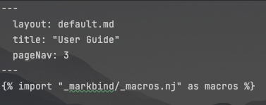
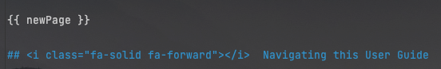
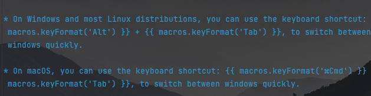



# TAPro Developer Guide

<!-- * Table of Contents -->
<div class="d-none d-print-block">
<br>
<include src="DGContentPage.md" />
</div>

{{ newPage }}

## **Acknowledgements**

**Code:**

* Trie implementation is reused from [eugenp's tutorials](https://github.com/eugenp/tutorials) with minor modifications.

**Documentation:**

* Icons in our User Guide and Developer Guide are taken from [Font Awesome](https://fontawesome.com/).
* Our documentation is generated using [MarkBind](https://markbind.org/index.html), with [Nunjucks](https://mozilla.github.io/nunjucks/) variables and macros.
* Our UML diagrams are generated using [PlantUML](https://plantuml.com/).

**Dev-dependencies:**

* The dependency [MarkBind](https://markbind.org/index.html), was used for having a live preview locally, through installing the [`markbind-cli`](https://www.npmjs.com/package/markbind-cli) package with [NPM](https://www.npmjs.com/), that runs over the [Node.js](https://nodejs.org/) runtime.
* The dependency [`captain-githook`](https://github.com/swellaby/captain-githook), was used for configuring git hooks, for pre-push and pre-commit checks.

**Ideas:**

* The idea of autocomplete and command history retrieval was adapted from common command terminals, like the [Windows Terminal](https://github.com/microsoft/terminal) and [Bash](https://en.wikipedia.org/wiki/Bash_(Unix_shell)), which had these features.
* The idea of syntax highlighting was adapted from common file editors, like [Visual Studio Code](https://code.visualstudio.com/) and Integrated Development Environments like [IntelliJ IDEA](https://www.jetbrains.com/idea/), which had syntax highlighting.

{{ newPage }}

## **Setting up, getting started**

Refer to the guide [_Setting up and getting started_](SettingUp.md).

{{ newPage }}

## **Design**

This section describes the design of various components of TAPro.

<br>

### Architecture

<puml src="diagrams/ArchitectureDiagram.puml" width="280" />

The ***Architecture Diagram*** given above explains the high-level design of TAPro.

Given below is a quick overview of main components and how they interact with each other.

<br>

#### Main components of the architecture

**`Main`** (consisting of classes [`Main`](https://github.com/AY2324S2-CS2103T-F13-1/tp/tree/master/src/main/java/seedu/address/Main.java) and [`MainApp`](https://github.com/AY2324S2-CS2103T-F13-1/tp/tree/master/src/main/java/seedu/address/MainApp.java)) is in charge of the app launch and shut down.
* At app launch, it initializes the other components in the correct sequence, and connects them up with each other.
* At shut down, it shuts down the other components and invokes cleanup methods where necessary.

The bulk of TAPro's work is done by the following four components:

* [**`UI`**](#ui-component): The UI of TAPro.
* [**`Logic`**](#logic-component): The command and autocomplete executor.
* [**`Model`**](#model-component): Holds the data of TAPro in memory.
* [**`Storage`**](#storage-component): Reads data from, and writes data to, the hard disk.

[**`Commons`**](#common-classes) represents a collection of classes used by multiple other components.

<br>
{{ newPageBetween }}

#### How the architecture components interact with each other

The *Sequence Diagram* below shows how the components interact with each other for the scenario where the user 
issues the command `delstu nn/E1234567`.

<puml src="diagrams/ArchitectureSequenceDiagram.puml" width="680" />

Each of the four main components (also shown in the diagram above),

* defines its *API* in an `interface` with the same name as the Component.
* implements its functionality using a concrete `{Component Name}Manager` class (which follows the corresponding API `interface` mentioned in the previous point.

<box type="success" light>

**#g#Example:##**

The `Logic` component defines its API in the `Logic.java` interface and implements its functionality using the `LogicManager.java` class which follows the `Logic` interface. 

Other components interact with a given component through its interface rather than the concrete class, as illustrated in the (partial) class diagram below.

<puml src="diagrams/ComponentManagers.puml" width="290" />

<box type="tip" light>

<span class="semi-bold">Reason:</span> To prevent outside component's being coupled to the implementation of a component.
</box>
</box>

The sections below give more details of each component.

{{ newPage }}

### UI component

The **API** of this component is specified in [`Ui.java`](https://github.com/AY2324S2-CS2103T-F13-1/tp/tree/master/src/main/java/seedu/address/ui/Ui.java)

<puml src="diagrams/UiClassDiagram.puml" alt="Structure of the UI Component"/>

The UI consists of a `MainWindow` that is made up of parts e.g.`CommandBox`, `ResultDisplay`, `PersonListPanel`, `StatusBarFooter` etc. All these, including the `MainWindow`, inherit from the abstract `UiPart` class which captures the commonalities between classes that represent parts of the visible GUI.

The `UI` component uses the JavaFx UI framework. The layout of these UI parts are defined in matching `.fxml` files that are in the `src/main/resources/view` folder. For example, the layout of the [`MainWindow`](https://github.com/AY2324S2-CS2103T-F13-1/tp/tree/master/src/main/java/seedu/address/ui/MainWindow.java) is specified in [`MainWindow.fxml`](https://github.com/AY2324S2-CS2103T-F13-1/tp/tree/master/src/main/resources/view/MainWindow.fxml)

**The `UI` component,**

* executes user commands using the `Logic` component.
* listens for changes to `Model` data so that the UI can be updated with the modified data.
* keeps a reference to the `Logic` component, because the `UI` relies on the `Logic` to execute commands.
* depends on some classes in the `Model` component, as it displays `Person` object residing in the `Model`.

{{ newPage }}

### Logic component

**API** : [`Logic.java`](https://github.com/AY2324S2-CS2103T-F13-1/tp/tree/master/src/main/java/seedu/address/logic/Logic.java)

Here's a (partial) class diagram of the `Logic` component:

<puml src="diagrams/LogicClassDiagram.puml" width="600"/>

The sequence diagram below illustrates the interactions within the `Logic` component, taking `execute("delstu nn/E1234567")` API 
call as an example.

<puml src="diagrams/DeleteSequenceDiagram.puml" alt="Interactions Inside the Logic Component for the `delstu e1234567` Command" />

<box type="info" light>

**Note:** The lifeline for `DeletePersonCommandParser` should end at the destroy marker (X) but due to a limitation of PlantUML, the lifeline continues till the end of diagram.
</box>

{{ newPageBetween }}

**How command execution works in `Logic` component:**

1. When `Logic` is called upon to execute a command, it is passed to an `AddressBookParser` object which in turn creates a parser that matches the command (e.g., `DeletePersonCommandParser`) and uses it to parse the command.
1. This results in a `Command` object (more precisely, an object of one of its subclasses e.g., `DeletePersonCommand`) which is executed by the `LogicManager`.
1. The command can communicate with the `Model` when it is executed (e.g. to delete a person).<br>
   Note that although this is shown as a single step in the diagram above (for simplicity), in the code it can take several interactions (between the command object and the `Model`) to achieve.
1. The result of the command execution is encapsulated as a `CommandResult` object which is returned back from `Logic`.

Here are the other classes in `Logic` (omitted from the class diagram above) that are used for parsing a user command:

<puml src="diagrams/ParserClasses.puml" width="600"/><br><br>

**How the parsing works:**
* When called upon to parse a user command, the `AddressBookParser` class creates an `XYZCommandParser` (`XYZ` is a placeholder for the specific command name e.g., `AddPersonCommandParser`) which uses the other classes shown above to parse the user command and create a `XYZCommand` object (e.g., `AddPersonCommand`) which the `AddressBookParser` returns back as a `Command` object.
  * All `XYZCommandParser` classes (e.g., `AddPersonCommandParser`, `DeletePersonCommandParser`, ...) inherit from the `Parser` interface so that they can be treated similarly where possible e.g, during testing.
* When called upon to parse an autocomplete input, the `AddressBookParser` class checks whether the input contains arguments. If it does not contain arguments, it creates an `AutoCompleteCommand` object which autocompletes Commands. Otherwise, it checks for the last argument in the user input and creates the matching `AutoComplete` object if it exists. Otherwise, a default `AutoComplete` object that always return an empty string is returned.

<box type="tip" light>

While a command is named as `XYZPersonCommandParser` internally (where `XYZ` is a placeholder for a specific command), it acts on a student externally in TAPro.
</box>

{{ newPage }}

### Model component
**API** : [`Model.java`](https://github.com/AY2324S2-CS2103T-F13-1/tp/tree/master/src/main/java/seedu/address/model/Model.java)

<puml src="diagrams/ModelClassDiagram.puml" width="630" />

**The `Model` component,**
* stores the contact book data i.e., all `Person` objects (which are contained in a `UniquePersonList` object).
* stores the currently 'selected' `Person` objects (e.g., results of a search query) as a separate _filtered_ list which is exposed to outsiders as an unmodifiable `ObservableList<Person>` that can be 'observed' e.g. the UI can be bound to this list so that the UI automatically updates when the data in the list change.
* stores a `UserPref` object that represents the user’s preferences. This is exposed to the outside as a `ReadOnlyUserPref` objects.
* stores a `CourseName` object that represent a Course code. This is exposed to the outside as a `ReadOnlyCourseName` object.
* does not depend on any of the other three components (as the `Model` represents data entities of the domain, they should make sense on their own without depending on other components)

<box type="tip" light>

While `Person` objects are used internally, it represents a student externally in TAPro.
</box>

{{ newPageBetween }}

<box type="info" light>

**An alternative model:**

An alternative (arguably, a more OOP) model is given below. It has a `Tag` list in the `AddressBook`, which `Person` references. This allows `AddressBook` to only require one `Tag` object per unique tag, instead of each `Person` needing their own `Tag` objects.<br>

<puml src="diagrams/BetterModelClassDiagram.puml" width="570" />

</box>

{{ newPageBetween }}

### Storage component

**API** : [`Storage.java`](https://github.com/AY2324S2-CS2103T-F13-1/tp/tree/master/src/main/java/seedu/address/storage/Storage.java)

<puml src="diagrams/StorageClassDiagram.puml" width="750" /><br><br>

**The `Storage` component,**
* can save both contact book data and user preference data and course name data in JSON format, and read them back into corresponding objects.
* inherits from both `AddressBookStorage` and `UserPrefStorage` and `CourseStorageName`, which means it can be treated as either one (if only the functionality of only one is needed).
* depends on some classes in the `Model` component (because the `Storage` component's job is to save/retrieve objects that belong to the `Model`)

<box type="tip" light>

While `AddressBookXYZ` objects are used internally (where `XYZ` is a placeholder), it represents the student contact book externally in TAPro.
</box>

{{ newPage }}

### Common classes

Classes used by multiple components are in the `seedu.addressbook.commons` package.

<br>

#### Trie

The `Trie` class is a data structure that allows for efficient prefix matching of strings. It is used in the `AutoComplete` feature to suggest completions for user input.

We added the ability to search for the first word that matches a given prefix. This is useful for the autocomplete feature, where we want to suggest the first word that matches the prefix.

{{ newPage }}

## **Implementation**

This section describes some noteworthy details on how certain features are implemented.

<markdown class="d-print-none">---</markdown>
<br>

### Autocomplete Feature

Here is a (partial) class diagram of the autocomplete feature. 

<puml src="diagrams/AutocompleteClassDiagram.puml" width="800"/><br><br>

There are 3 subcomponents in the [Logic component](#logic-component) that are involved the autocomplete feature, which are:
* Attribute Classes, that handle the resolution of dynamic attribute values. 
* Parser Classes, that handle the parsing of the user input.
* AutoComplete Classes, that handle the generation of the autocompletion.

<box type="info" light>

Omitted from the (partial) class diagram is the functional interface `AttributeValueGenerator`, which produces a `List<String>`, representing all possible values for an attribute of a student in TAPro's current data.

`AttributeValueGeneratorManager` has static methods that match the method signature of `AttributeValueGenerator`, which is pass in as an argument when creating a `PrefixResolver`.

`PrefixResolverSyntax` stores preset `PrefixResolvers` for all the `Prefix`s that can be autocompleted.
</box>

{{ newPageBetween }}

There are two variants of autocomplete feature. One variant is the autocompletion of static data using `AutoCompleteCommand`. Another variant is the autocompletion of dynamic data using `AutoCompletePrefixResolver`.

**How autocompletion of static data works using `AutoCompleteCommand` in the `Logic` component:**

1. When `Logic` is called upon to autocomplete an input string, it is passed to an `AddressBookParser` object which in turn matches the input and return the corresponding `AutoComplete` object, `AutoCompleteCommand` in this case.
1. `AutoCompleteCommand` then produces an `AutoCompleteResult` which is executed by the `LogicManager`.
1. `AutoCompleteCommand` classes uses [`Trie`](#trie) under the hood to efficiently generate the autocomplete suggestions. The `Trie` is preloaded with static data of our command names (e.g. `addstu`), which is used to generate the suggestions.
1. The `AutoCompleteResult` object is solely responsible for generating the autocomplete suggestions based on the input string (e.g. the additional characters that can be appended to the input string).
1. The result of the autocompletion is simply a list of string suggestions that autocompletes the input string. 

**How autocompletion of dynamic data works using `AutoCompletePrefixResolver` in the `Logic` component:**

In the autocompletion of dynamic data there are 5 key steps:
1. Notifying that the data is outdated
2. Using the autocomplete hotkey to return the autocompletion
3. Parsing the input to call the corresponding kind of autocompletion
4. Generating the autocomplete result
5. Updating the new attribute data into the `AttributeTrie`

{{ newPageBetween }}

**Step 1. How the `AttributeTrie` is notified of new data:**

1. When a command is executed, a check is performed in `LogicManager` to determine if the command could potentially modify the data.
1. If the data could be modified, then we would get the latest `addressBook` using `getAddressBook()`.
1. Then using the latest `addressBook`, we would update the `AttributeValueGeneratorManager` with `updateAddressBook(addressBook)`.
1. We iterate through all prefix resolvers to notify that the `PrefixResolver` needs to be updated using `notifyOutdatedData`.
1. Then `PrefixResolver` calls its corresponding `AttributeTrie` to `clearCache()`, which removes the `Trie` that is used internally. The absence of a `Trie` would cause `AttributeTrie` to lazily generate a new `Trie` using new data. Meaning that a new `Trie` is only generated when necessary.

<puml src="diagrams/AutocompleteUpdateSequenceDiagram.puml" width="790"/><br><br>

{{ newPageBetween }}

**Step 2. How the autocomplete hotkey works:**

1. After the autocomplete hotkey {{ macros.keyFormat('Tab') }} is pressed, the method `handleTabKeyPressEvent(...)` is called.
1. Whenever `lastModifiedText` has changed, it means that the text in the `CommandBox`'s command input box has changed (e.g. the user types into the command input box), so the `autoCompleteResultCache` is set to `null` to indicate that the `AutoCompleteResult` is outdated.
1. If the `autoCompleteResultCache` is `null`, then we know that the `lastModifiedText` has changed, so we need to generate a new autocomplete result. We do this by calling `MainWindow#getAutoComplete(lastModifiedText)`, which calls the `LogicManager` to generate a new autocomplete result.
1. Otherwise, it means the `autoCompleteResultCache` still contains the latest `AutoCompleteResult` that works for the current `lastModifiedText`.
1. Once we have the latest `autoCompleteResultCache`, we call `autoCompleteResultCache.getNextResult()` to generate the next autocompletion.
1. Lastly, the text in the `CommandBox`'s command input box is updated to the suggested autocompletion using `setText(...)`.

<puml src="diagrams/AutocompleteKeySequenceDiagram.puml" width="820"/><br><br>

<box type="info" light>

The reference frame below, `create empty autocomplete`, is used in the next few sequence diagrams. It represents that an `AutoCompleteResult` with no autocomplete suggestion is returned, meaning that pressing the autocomplete hotkey would cause no change in `CommandBox`'s command input box when it is used.

<puml src="diagrams/AutoCompleteEmptyConstructorSequenceDiagram.puml" width="250"/>
</box>

{{ newPageBetween }}

**Step 3. How `LogicManager` parses the input to generate a new `AutoCompleteResult`:**

1. When `LogicManager#autoComplete(commandText)` is called with the text `commandText` to autocomplete, it calls the `AddressBookParser#parseAutoComplete(commandText)` method.
1. Depending on the `commandText` passed into `parseAutoComplete`, there are 3 possible paths:
1. The first path is that the `commandText` cannot be parsed as it doesn't meet format specifications.
1. The second path is that the `commandText` can be parsed, but is missing prefixes inside the text, so it is treated as an autocompletion for a command name. `AutoCompleteCommand` is then constructed and used like how autocompletion of static data works.
1. The final path is that the `commandText` can be parsed, and contains at least one prefix in the text, so it is treated as an autocompletion for a prefix. `AutoCompletePrefixResolver` is then constructed using `ALL_PREFIX_RESOLVERS` and used later on in `getAutoComplete`, given an `input`, to generate an autocompletion.
1. In all cases, a `AutoComplete` is returned, which `AutoCompleteCommand` and `AutoCompletePrefixResolver` are subclasses of.
1. The `AutoComplete` produces a `AutoCompleteResult`, which is passed back to the `MainWindow`.

<puml src="diagrams/AutocompleteParseSequenceDiagram.puml" width="950"/><br><br>

{{ newPageBetween }}

**Step 4. How `AutoCompletePrefixResolver` is generates an `AutoCompleteResult`:**

1. When `AutoCompletePrefixResolver#getAutoComplete(input)` is called, if the `input` is blank, an empty `AutoCompleteResult` is returned.
1. Otherwise, it calls `findTriePrefixContinuation(input)` which would find the text, that continues from a given input, in the `AttributeTrie`. This may update the `AttributeTrie` with new attribute data if necessary, due to the lazy evaluation.
1. Then with the `trieMatchContinuations` returned from `findTriePrefixContinuation`, we use it to create the `AutoCompleteResult`.
1. If `trieMatchContinations` is empty, it means there are no autocomplete results for the current `input`, so an empty `AutoCompleteResult` is returned.
1. Otherwise, an `AutoCompleteResult` with the associated `trieMatchContinuations` is returned.

<puml src="diagrams/AutoCompletePrefixResolverSequenceDiagram.puml" width="600"/><br><br>

{{ newPageBetween }}

**Step 5. How `AttributeTrie` is updated with new attribute data and returns the matches:**

1. When `AutoCompletePrefixResolver#findTriePrefixContinuation(input)` is called, `findLastPrefixIndex(input)` is called which returns `indexOfLastPrefix`.
1. Then, with the `indexOfLastPrefix`, it calls `findLastPrefix` to find the last prefix in the `input`.
1. We iterate through all the `PrefixResolver`s to find one where `lastPrefix` matches the `PrefixResolver`'s `Prefix`.
1. If there is a match, we call `PrefixResolver#resolvePrefix(partialValue)` on the matching `PrefixResolver`, which calls `AttributeTrie#findAllValuesWithPrefix(partialValue)`.
1. When the `trieCache` is absent, it means that the `AttributeTrie#clearCache()` has been called before without a new `Trie` being generated. So `generateTrie()` is called, which generates values in the `Trie` using a `AttributeValueGenerator` which generates a list of attribute values to populate the `Trie` with.
1. The `AttributeTrie` then computes the list of values with the prefix and returns it back.
1. Finally, `AutoCompletePrefixResolver` formats the list of values and returns it as `trieMatchContinuations`, which are text continuations from the given `input`. 

<puml src="diagrams/AutocompleteFindTrieMatchesSequenceDiagram.puml" width="850"/><br><br>

{{ newPageBetween }}

#### Design considerations

**1. Separation of concerns:**

As the autocomplete feature involves many classes all over the codebase, it is important to handle the separation of concerns carefully, to lead to higher cohesion and lower coupling. 

This was done through the following:
* Separating the notifying and updating of data from the storage, by using the methods `PrefixResolver#notifyOutdatedData` and `AttributeValueGeneratorManager#updateAddressBook`. 
  * How it worked was using the functional interface, `AttributeValueGenerator`, that is used by `AttributeValueGenerateManager` to generate an attribute values given the `addressBook`. The `AttributeValueGenerator` is then passed into the `AttributeTrie` to generate values to insert into the `Trie`.
* Separating the dynamic autocompletion from the static autocompletion, as their internal implementations were different.
* Having each of the subcomponents, Attribute Classes, Parser Classes and AutoComplete Classes, as packages, which encapsulates them, limiting functional overlaps.

**2. Caching of intermediate results for improved performance:**

There are two layers in the current implementation used for caching, which are: 
* When the current `lastModifiedText` doesn't change, caching the `AutoCompleteResult` in `autoCompleteResultCache`.
* When the current data in the `addressBook` doesn't change, caching the `Trie` stored in the `AttributeTrie`.

By having caching of intermediate results, it reduces the need to recompute certain results, thus improving performance of TAPro on users' systems.

**3. Lazy evaluation to reduce redundant computations:**

Lazy evaluation is carried out in `AttributeTrie`, where the new `Trie` was lazily evaluated. It means that the `Trie` was only generated when the autocompletion of a parameter value doesn't have an `AttributeTrie` already present.

<br>

#### Future improvements to the autocomplete feature

**Improve detection on whether attributes are actually modified before updating their `AttributeTrie`s:**
* Currently, our implementation causes all tries to be lazily reevaluated when a command potentially modifies the data. However, not all commands would actually modify the all data attribute values, but may only update a subset of those attribute values, or even none of the attribute values at all.
* Hence, we plan to check if the data for an attribute is actually modified before updating their respective `AttributeTrie`s, which would improve the performance of our autocompletion feature.

{{ newPage }}

### Command History Retrieval

Let's consider the scenario where the user wants to retrieve the last command executed. The user can do this by 
pressing the {{ macros.keyFormat('Up', '<i class="fa-regular fa-square-caret-up"></i>') }} key on 
the keyboard. 

The {{ macros.keyFormat('Up', '<i class="fa-regular fa-square-caret-up"></i>') }} key press event is captured by the `CommandBox` class, which then 
retrieves the last command from the `CommandHistory` Singleton object.
<puml src="diagrams/CommandHistorySequenceDiagram.puml" alt="Command History Sequence Diagram" />

<box type="info" light>

**Note:** The `CommandHistory` Singleton object is used to store the command history. It is a Singleton object to ensure that there is only one instance of the `CommandHistory` object throughout the application.

</box>

Below is the activity diagram that shows how the process of a user interacting with the input field to retrieve the 
last command executed.

<puml src="diagrams/CommandHistoryActivityDiagram.puml" width="750" />


{{ newPage }}

### \[Proposed\] Undo/Redo Feature

#### Proposed Implementation

The proposed undo/redo mechanism is facilitated by `VersionedAddressBook`. It extends `AddressBook` with an undo/redo history, stored internally as an `addressBookStateList` and `currentStatePointer`. Additionally, it implements the following operations:

* `VersionedAddressBook#commit()` — Saves the current contact book state in its history.
* `VersionedAddressBook#undo()` — Restores the previous contact book state from its history.
* `VersionedAddressBook#redo()` — Restores a previously undone contact book state from its history.

These operations are exposed in the `Model` interface as `Model#commitAddressBook()`, `Model#undoAddressBook()` and `Model#redoAddressBook()` respectively.

Given below is an example usage scenario and how the undo/redo mechanism behaves at each step.

**Step 1.** The user launches the application for the first time. The `VersionedAddressBook` will be initialized with the initial contact book state, and the `currentStatePointer` pointing to that single contact book state.

<puml src="diagrams/UndoRedoState0.puml" alt="UndoRedoState0" /><br><br>

**Step 2.** The user executes `delstu nn/E1234567` command to delete student with NUSNet ID as E1234567 from the contact book. 
The `delstu` 
command 
calls 
`Model#commitAddressBook()`, causing the modified state of the contact book after the `delstu nn/E1234567` command 
executes to 
be saved in the `addressBookStateList`, and the `currentStatePointer` is shifted to the newly inserted contact book state.

<puml src="diagrams/UndoRedoState1.puml" alt="UndoRedoState1" /><br><br>

{{ newPageBetween }}

**Step 3.** The user executes `addstu n/David …​` to add a new person. The `addstu` command also calls `Model#commitAddressBook()`, causing another modified contact book state to be saved into the `addressBookStateList`.

<puml src="diagrams/UndoRedoState2.puml" alt="UndoRedoState2" />

<box type="info" light>

**Note:** If a command fails its execution, it will not call `Model#commitAddressBook()`, so the contact book state will not be saved into the `addressBookStateList`.

</box><br>

**Step 4.** The user now decides that adding the person was a mistake, and decides to undo that action by executing the `undo` command. The `undo` command will call `Model#undoAddressBook()`, which will shift the `currentStatePointer` once to the left, pointing it to the previous contact book state, and restores the contact book to that state.

<puml src="diagrams/UndoRedoState3.puml" alt="UndoRedoState3" /><br><br>

{{ newPageBetween }}

**Step 5.** The user wants to set the course name. He enters the command `setcrs CS2103T`, causing the course name to appear on the main window's title.


<box type="info" light>

**Note:** If the `currentStatePointer` is at index 0, pointing to the initial `AddressBook` state, then there are no previous `AddressBook` states to restore. The `undo` command uses `Model#canUndoAddressBook()` to check if this is the case. If so, it will return an error to the user rather
than attempting to perform the undo.

</box>

The following sequence diagram shows how an undo operation goes through the `Logic` component:

<puml src="diagrams/UndoSequenceDiagram-Logic.puml" alt="UndoSequenceDiagram-Logic" />

<box type="info" light>

**Note:** The lifeline for `UndoCommand` should end at the destroy marker (X) but due to a limitation of PlantUML, the lifeline reaches the end of diagram.

</box>

Similarly, how an undo operation goes through the `Model` component is shown below:

<puml src="diagrams/UndoSequenceDiagram-Model.puml" alt="UndoSequenceDiagram-Model" />

The `redo` command does the opposite — it calls `Model#redoAddressBook()`, which shifts the `currentStatePointer` once to the right, pointing to the previously undone state, and restores the contact book to that state.

<box type="info" light>

**Note:** If the `currentStatePointer` is at index `addressBookStateList.size() - 1`, pointing to the latest contact book state, then there are no undone `AddressBook` states to restore. The `redo` command uses `Model#canRedoAddressBook()` to check if this is the case. If so, it will return an error to the user rather than attempting to perform the redo.

</box><br>

{{ newPageBetween }}

**Step 6.** The user then decides to execute the command `list`. Commands that do not modify the contact book, such as `list`, will usually not call `Model#commitAddressBook()`, `Model#undoAddressBook()` or `Model#redoAddressBook()`. Thus, the `addressBookStateList` remains unchanged.

<puml src="diagrams/UndoRedoState4.puml" alt="UndoRedoState4" /><br><br>

**Step 7.** The user executes `clear`, which calls `Model#commitAddressBook()`. Since the `currentStatePointer` is not pointing at the end of the `addressBookStateList`, all contact book states after the `currentStatePointer` will be purged. Reason: It no longer makes sense to redo the `addstu n/David …​` command. This is the behavior that most modern desktop applications follow.

<puml src="diagrams/UndoRedoState5.puml" alt="UndoRedoState5" />

The following activity diagram summarizes what happens when a user executes a new command:

<puml src="diagrams/CommitActivityDiagram.puml" width="270" /><br><br>

{{ newPageBetween }}

#### Design considerations

**Aspect: How undo & redo executes:**

* **Alternative 1 (current choice):** Saves the entire contact book.
  * Pros: Easy to implement.
  * Cons: May have performance issues in terms of memory usage.

<br>

* **Alternative 2:** Individual command knows how to undo/redo by
  itself.
  * Pros: Will use less memory (e.g. for `delstu`, just save the person being deleted).
  * Cons: We must ensure that the implementation of each individual command are correct.


{{ newPage }}

## **Documentation, logging, testing, configuration, dev-ops**

* [Documentation guide](Documentation.md)
* [Testing guide](Testing.md)
* [Logging guide](Logging.md)
* [Configuration guide](Configuration.md)
* [DevOps guide](DevOps.md)

{{ newPage }}

## **Appendix: Requirements**

<br>

### Product scope

**Target user profile**:
* Teaching Assistant for one Computer Science module in NUS
* Tech savvy
* Prefer desktop apps over other types
* Can type fast
* Prefers typing to mouse interactions
* Is reasonably comfortable using CLI apps

**Value proposition**: All in one contact book managing student’s progress in the course, by means of attendance of the NUS CS class. Can quickly find information and perform operations with keyboard shortcuts.

{{ newPage }}

### User stories

<box type="definition" light>

**Priorities:** 
* <span class="semi-bold">#g#High:##</span> (must have) - {{ threeStars }}
* <span style="color:#FF7F00;" class="semi-bold">Medium</span> (should have) - {{ twoStars }}
* <span class="semi-bold">#r#Low:##</span> (nice to have) - {{ oneStar }}
</box>


[//]: # (whitespace is added to force the header row into one line)


| Priority         | As a …                     | I want to …                                                        | So that I can…                                       |
|------------------|----------------------------|--------------------------------------------------------------------|------------------------------------------------------|
| {{ threeStars }} | TA                         | name/rename the CS course that I am tutoring this semester         | keep track of the module I am teaching               |
| {{ threeStars }} | TA                         | add a student to the my class that I am tutoring this semester     | keep track of him or her                             |
| {{ threeStars }} | TA                         | view all students from my class                                    | view details about all of them                       |
| {{ threeStars }} | TA                         | delete a student                                                   | remove a student if he or she leaves the class       |
| {{ threeStars }} | TA                         | see all students in the contact book                               | have an overview of all students                     |
| {{ threeStars }} | TA                         | edit a student's details                                           | have the latest data                                 |
| {{ threeStars }} | TA                         | find a student by name                                             | get a student's data easily                          |
| {{ threeStars }} | attendance tracking TA     | mark attendance for a student in my class for a particular week    | keep track of who is present                         |
| {{ threeStars }} | attendance tracking TA     | unmark attendance for a student in my class for a particular week  | keep track of who is absent                          |
| {{ twoStars }}   | TA over multiple semesters | delete all students from a previous semester from the contact book | clear my contacts quickly at the start of a semester |
| {{ twoStars }}   | new user                   | know all the commands of TAPro via the help window                 | use it effectively                                   |
| {{ twoStars }}   | user comfortable with CLI  | retrieve command history                                           | avoid retyping a command                             |
| {{ twoStars }}   | user comfortable with CLI  | autocomplete my input                                              | save time                                            |
| {{ twoStars }}   | fast typist                | use keyboard inputs to interact with TAPro                         | save time                                            |
| {{ twoStars }}   | user                       | exit the program smoothly                                          | save time                                            |
| {{ oneStar }}    | user                       | easily read the result message of a command                        | save time                                            |


{{ newPage }}

### Use cases

<box type="info" light>

For all use cases below, the **System** is TAPro and the **Actor** is the user, unless specified otherwise.
</box>
<br>

<box no-icon type="success" light>

**Use case: Learn How to Use Available Commands in TAPro**

<span class="semi-bold">MSS</span>

1. User requests to view the list of available commands for TAPro.

2. TAPro displays the list of available commands and a guide on how to use each command.

   Use case ends.

</box>

<box no-icon type="success" light>

**Use case: Add a Student**

<span class="semi-bold">MSS</span>

1. User requests to add a student, providing the name and NUSNet ID as compulsory information, with the phone number, email, major and tags being optional.

2. TAPro adds the student to the list of students.

   Use case ends.

<span class="semi-bold">Extensions</span>

* 2a. Format of the provided data is incorrect.

    * 2a1. TAPro rejects the student addition and shows an error message.

    * Use case ends.
  
</box>

{{ newPageBetween }}

<box no-icon type="success" light>

**Use case: Editing a Student**

<span class="semi-bold">MSS</span>

1. User requests to edit an existing student, indicating the student the user wish to edit. The user provides the update details for the student and remaining details are unchanged.

2. TAPro updates the student with the new details.

   Use case ends.

<span class="semi-bold">Extensions</span>

* 2a. No such student exists.

    * 2a1. TAPro shows an error message.

    * Use case ends.

* 2b. User provides no details to update.

    * 2b1. TAPro shows an error message.

    * Use case ends.

* 2c. Format of the provided data is incorrect.

    * 2c1. TAPro rejects the student update and shows an error message.

    * Use case ends.

</box>

<box no-icon type="success" light>

**Use case: Delete a Student**

<span class="semi-bold">MSS</span>

1. User requests to delete a specific student based on NUSNet ID.

2. TAPro deletes the student from the list of students.

   Use case ends.

<span class="semi-bold">Extensions</span>

* 2a. No such student exists.

    * 2a1. TAPro shows an error message.

    * Use case ends.

* 2b. Format of the provided data is incorrect.

    * 2b1. TAPro shows an error message.

    * Use case ends.

</box>

{{ newPageBetween }}

<box no-icon type="success" light>

**Use case: Name or Rename CS Course**

<span class="semi-bold">MSS</span>

1. User requests to name or rename a CS course by specifying the course code.

2. TAPro names or renames the CS course on the application window bar.

   Use case ends.

<span class="semi-bold">Extensions</span>

* 2b. Format of the provided course code is incorrect.

    * 2b1. TAPro shows an error message.

    * Use case ends.

</box>

<box no-icon type="success" light>

**Use case: View All Students**

<span class="semi-bold">MSS</span>

1. User requests to view a list of all students.

2. TAPro displays a list of all students.

    Use case ends.

</box>

<box no-icon type="success" light>

**Use case: Find a Student by Name**

<span class="semi-bold">MSS</span>

1. User requests to find all students by one or more keywords in the student's name.

2. TAPro displays a list of students whose names contain the keyword(s).

    Use case ends.

<span class="semi-bold">Extensions</span>

* 2a. No student exists with the given keyword(s).

    * 2a1. TAPro shows no students.

    * Use case ends.

</box>

{{ newPageBetween }}

<box no-icon type="success" light>

**Use case: Mark Attendance**

<span class="semi-bold">MSS</span>

1. User requests to mark attendance for a student by providing the student's NUSNet ID and week number to mark the attendance for.

2. TAPro marks the attendance for the student for the specified week.

   Use case ends.

<span class="semi-bold">Extensions</span>

* 2a. No such student exists.

    * 2a1. TAPro shows an error message.

    * Use case ends.
  
* 2b. Week number is invalid.

    * 2b1. TAPro shows an error message.

    * Use case ends.    

</box>

<box no-icon type="success" light>

**Use case: Unmark Attendance**

<span class="semi-bold">MSS</span>

1. User requests to unmark attendance for a student by providing the student's NUSNet ID and week number to unmark the attendance for.

2. TAPro unmarks the attendance for the student for the specified week.

   Use case ends.

<span class="semi-bold">Extensions</span>

* 2a. No such student exists.

    * 2a1. TAPro shows an error message.

    * Use case ends.

* 2b. Week number is invalid.

    * 2b1. TAPro shows an error message.

    * Use case ends.

</box>

<box no-icon type="success" light>

**Use case: Clear All Data**

<span class="semi-bold">MSS</span>

1. User requests to purge all data from TAPro.

2. TAPro successfully clears all data.

   Use case ends.

</box>

<box no-icon type="success" light>

**Use case: Autocompletion of Command Inputs**

<span class="semi-bold">MSS</span>

1. User focuses on the command box.

2. User presses the autocompletion hotkey.

3. Autocompleted command is shown in the command box.

   Use case ends.

<span class="semi-bold">Extensions</span>

* 3a. No autocompletion is available for the current input.

    * 3a1. No action is taken.

    * Use case ends.

</box>

<box no-icon type="success" light>

**Use case: Retrieve a Previous Successful Command Input**

<span class="semi-bold">MSS</span>

1. User focuses on the command box.

2. User presses the retrieve previous command hotkey.

3. TAPro displays the successful command input in the command box.

   Use case ends.

<span class="semi-bold">Extensions</span>

* 3a. No previous successful command input is available.

    * 3a1. No action is taken.

    * Use case ends.

</box>

<box no-icon type="success" light>

**Use case: Retrieve a More Recent Successful Command Input**

<span class="semi-bold">MSS</span>

1. User focuses on the command box.

2. User presses the retrieve next command hotkey.

3. TAPro displays a more recent successful command input in the command box.

   Use case ends.

<span class="semi-bold">Extensions</span>

* 3a. No successful command input that is more recent is available.

    * 3a1. The command box will be cleared

    * Use case ends.

</box>

{{ newPage }}

### Non-Functional Requirements

1.  Should work on any _mainstream OS_ as long as it has Java 11 installed.
2.  System to load the main interface in under 1 second on standard educational institution hardware.
3.  Application to be accessible on devices commonly used by the educational institution, such as desktop computers, laptops, and tablet.
4.  System to ensure data integrity, with a goal of zero data loss over the academic year.
5.  Input validation to prevent errors due to incorrect data entry.
6.  Application to handle common errors gracefully, such as incorrect data entry, without crashing or losing data.

{{ newPage }}

### Glossary

{{ macros.definitionBox('ASCIIbetical Order', 'An ordering where numbers and most punctuations are before letters, and uppercase letters before lowercase letters.') }}
{{ macros.definitionBox('API', 'Application Programming Interface') }}
{{ macros.definitionBox('CLI', 'Command Line Interface') }}
{{ macros.definitionBox('CS', 'Computer Science') }}
{{ macros.definitionBox('GUI', 'Graphical User Interface') }}
{{ macros.definitionBox('Mainstream OS', 'Windows, Linux, Unix, MacOS') }}
{{ macros.definitionBox('NUS', 'National University of Singapore') }}
{{ macros.definitionBox('NUSNet ID', 'A unique identifier for each student in NUS') }}
{{ macros.definitionBox('TA', 'Teaching Assistant') }}
{{ macros.definitionBox('TAPro', 'The name of our product') }}
{{ macros.definitionBox('UI', 'User Interface') }}

{{ newPage }}

## **Appendix: Instructions for manual testing**

Given below are instructions to test the app manually. 

<box type="info" light>

**Prerequisites:** For all features to test below, TAPro is already downloaded, only single instance of TAPro is already opened, and Java 11 or above is installed, unless specified otherwise.
</box>

<box type="info" light>

**Note:** These instructions only provide a starting point for testers to work on;
testers are expected to do more *exploratory* testing.

</box>

<br>

### Launch and shutdown

1. **Initial launch**

<box type="info" light>

<span class="semi-bold">1. Prerequisites:</span> TAPro is not downloaded, and an Internet connection is present.
</box>

<box type="success" light>

2. Download the latest TAPro jar file from [here](https://github.com/AY2324S2-CS2103T-F13-1/tp/releases) and move it into an empty folder. 

3. Ensure that the jar file is still named as `TAPro.jar` after moving.

4. Open a command terminal, and `cd` into that folder.

5. Run `java -jar TAPro.jar`.

<span class="semi-bold">Expected:</span> TAPro launches and shows the GUI with a set of sample student contacts. The window size may not be optimal.
</box>

2. **Saving window preferences**

<box type="info" light>

<span class="semi-bold">1. Prerequisites:</span> No prerequisites.
</box>

<box type="success" light>

2. Resize the window to an optimum size. Move the window to a different location. Close the window.

3. Re-launch the app by double-clicking the jar file.<br>

<span class="semi-bold">Expected:</span> The most recent window size and location is retained.
</box>

{{ newPageBetween }}

### Adding a student
If TAPro does not have any student contacts, the following commands can be used to add some 
students.

1. **Adding a student with NUSNet ID E0123456**

<box type="info" light>

<span class="semi-bold">1. Prerequisites:</span> No student with NUSNet ID E0123456 in TAPro.
</box>

<box type="success" light>

<span class="semi-bold">2. Test case:</span>
```
addstu n/John Doe p/98765432 e/johndoe@example.com nn/E0123456 m/Computer Science t/friends t/owesMoney
```

<span class="semi-bold">Expected:</span> Student with NUSNet ID `E0123456` is added into TAPro. Details of the added student is
shown in the result message panel.
</box>
      
2. **Adding a student with NUSNet ID E0123457**

<box type="info" light>

<span class="semi-bold">1. Prerequisites:</span> No student with NUSNet ID E0123457 in TAPro.
</box>

<box type="success" light>

<span class="semi-bold">2. Test case:</span>
```
addstu n/Mary Jane p/91234911 e/janemary@example.com nn/E0123457 m/Biology t/friends t/owesTutorial2
```

<span class="semi-bold">Expected:</span> Student with NUSNet ID `E0123457` is added into TAPro. Details of the added student is
shown in the result message panel.
</box>

{{ newPageBetween }}

### Editing a student

1. **Editing information of a student with NUSNet ID E0123457**

<box type="info" light>

<span class="semi-bold">1. Prerequisites:</span> An existing student in TAPro with NUSNet ID E0123457 shown as index 
2 in TAPro's displayed person list.

You may run 
the above last `addstu` command to add a student with NUSNet ID E0123457 if it does not exist.
</box>

<box type="success" light>

<span class="semi-bold">2. Test case:</span>
```
edit 2 p/98765432 m/Computer Science
```

<span class="semi-bold">Expected:</span> Information of student with NUSNet ID `E0123457` is updated in TAPro. Details of the added student is
shown in the status message.
</box>

<box type="info" light>

This command differs from most other commands that use the `NUSNET` to identify a student. This command uses the index number shown in the displayed person list to identify the student to be edited.
</box>

{{ newPageBetween }}

### Deleting a student

1. **Deleting a student**

<box type="info" light>

<span class="semi-bold">1. Prerequisites:</span> TAPro contains at least one student with NUSNet ID E0123456, and no student with NUSNet ID E6543210.
</box>

<box type="success" light>

<span class="semi-bold">2. Test case:</span>
```
delstu nn/E0123456
```

<span class="semi-bold">Expected:</span> The student with NUSNet ID `E0123456` is deleted from TAPro. Details of the deleted student
shown in the result message panel.
</box>

<box type="wrong" light>

<span class="semi-bold">3. Other incorrect `delstu` commands to try:</span>
* Missing parameter and prefix:
```
delstu
```

* No student with this NUSNet ID:
```
delstu nn/E6543210
```

* Missing prefix for the NUSNet ID parameter:
```
delstu E0123456
```
</box>

{{ newPageBetween }}

### Finding a student


1. **Finding a student**

<box type="info" light>

<span class="semi-bold">1. Prerequisites:</span> TAPro contains one student with the name 'John Doe'.
</box>

<box type="success" light>

<span class="semi-bold">2. Test case:</span>
```
find john
```

<span class="semi-bold">Expected:</span> Student with name 'John Doe' is displayed on the student contact cards panel.
</box>

<box type="wrong" light>

<span class="semi-bold">3. Other incorrect `find` commands to try:</span>
* Missing keyword:
```
find
```
</box>

{{ newPageBetween }}

### Marking a student's attendance

1. **Marking attendance for a student**

<box type="info" light>

<span class="semi-bold">1. Prerequisites:</span> TAPro contains one student with NUSNet ID `E0123456`, and no student with NUSNet ID `E6543210`.
</box>

<box type="success" light>

<span class="semi-bold">2. Test case:</span>
```
mark nn/E0123456 wk/1
```

<span class="semi-bold">Expected:</span> Student with NUSNet ID `E0123456` is marked as present for week 1 in TAPro, depicted on that student's card in the panel.
Details of the marked student is shown in the result message panel.
</box>

<box type="wrong" light>

<span class="semi-bold">3. Examples of incorrect `mark` commands to try:</span>
* Missing NUSNet ID and week number parameters:
```
mark
```

* No student with this NUSNet ID:
```
mark nn/E6543210 wk/1
```

* Missing the NUSNet ID parameter:
```
mark wk/1
```

* Missing prefix for the NUSNet ID and week number parameters:
```
mark E0123456 1
```
</box>

{{ newPageBetween }}

### Unmarking a student's attendance

<box type="info" light>

<span class="semi-bold">1. Prerequisites:</span> TAPro contains one student with NUSNet ID `E0123456` with his Week 1's attendance marked 
and no 
student with NUSNet ID `E6543210`.
</box>

<box type="success" light>

<span class="semi-bold">2. Test case:</span>
```
unmark nn/E0123456 wk/1
```

<span class="semi-bold">Expected:</span> Student with NUSNet ID `E0123456` is not marked as for week 1 in TAPro, depicted on that student's 
card in the panel.
Details of the marked student is shown in the status message.
</box>

<box type="wrong" light>

<span class="semi-bold">3. Examples of incorrect `unmark` commands to try:</span>
* Missing NUSNet ID and week number parameters:
```
unmark
```

* No student with this NUSNet ID:
```
unmark nn/E6543210 wk/1
```

* Missing the NUSNet ID parameter:
```
unmark wk/1
```

* Missing prefix for the NUSNet ID and week number parameters:
```
unmark E0123456 1
```
  </box>

{{ newPageBetween }}


### Setting the course name

1. **Setting a course name**

<box type="info" light>

<span class="semi-bold">1. Prerequisites:</span> No prerequisites.
</box>

<box type="success" light>

<span class="semi-bold">2. Test case:</span>
```
setcrs CS2103
```

<box type="info" light>

Enter `setcrs` followed by a whitespace, followed by a course code in the format `XXYYYYZ`, where `X` and `Z` can be any letter
in upper or lower case, `YYYY` can be any 4-digit number and `Z` is optional.
</box>

<span class="semi-bold">Expected:</span> TAPro's main window's title contains the course code `CS2103` provided.
</box>

{{ newPageBetween }}

### Autocompleting fields

1. **Autocompleting the `addstu` command name**

<box type="info" light>

<span class="semi-bold">1. Prerequisites:</span> No prerequisites.
</box>

<box type="success" light>

<span class="semi-bold">2. Test case:</span>
```
a
```
Then press {{ macros.keyFormat('Tab') }}.

<span class="semi-bold">Expected:</span> The command box input text changes to:
```
addstu
```
</box>


2. **Autocompleting the parameter `MAJOR`**

<box type="info" light>

<span class="semi-bold">1. Prerequisites:</span> There is at least one student, and all students have the major `Computer Science`.
</box>

<box type="success" light>

<span class="semi-bold">2. Test case:</span>
```
edit 1 m/
```
Then press {{ macros.keyFormat('Tab') }}.

<span class="semi-bold">Expected:</span> The command box input text changes to:
```
edit 1 m/Computer Science
```
</box>

{{ newPageBetween }}

### Retrieving previous successful commands

<box type="info" light>

<span class="semi-bold">1. Prerequisites:</span> Ran the following command as the previous command:
```
mark nn/E0123456 wk/6
```
</box>


<box type="success" light>

<span class="semi-bold">2. Test case: Retrieving a previous command with 
{{ macros.keyFormat('Up', '<i class="fa-regular fa-square-caret-up"></i>') }} key </span>

* After the entering that previous command, the command input box is empty.
* Pressing {{ macros.keyFormat('Up', '<i class="fa-regular fa-square-caret-up"></i>') }} will
  fill the text in the command input box to
  the previous command:
```
mark nn/E0123456 wk/6
```
* You can press {{ macros.keyFormat('Up', '<i class="fa-regular fa-square-caret-up"></i>') }} continuously to scroll 
  through all the previous (successful) commands you have entered.
* Pressing {{ macros.keyFormat('Down', '<i class="fa-regular fa-square-caret-down"></i>') }} will
  scroll back to the more recent commands you have entered.

</box>
</box>

{{ newPageBetween }}

### Accessing help

1. **Accessing help**

<box type="info" light>

<span class="semi-bold">1. Prerequisites:</span> No prerequisites.
</box>

<box type="success" light>

<span class="semi-bold">2. Test case:</span>
```
help
```

<span class="semi-bold">Expected:</span> The help window automatically pops up, giving further information about TAPro's commands.
</box>

{{ newPageBetween }}

### Clearing all data


1. **Clearing all students**

<box type="info" light>

<span class="semi-bold">1. Prerequisites:</span> No prerequisites.
</box>

<box type="success" light>

<span class="semi-bold">2. Test case:</span>
```
clear
```

<span class="semi-bold">Expected:</span> TAPro's Contact Book resets, clearing all existing students (if any).
</box>

{{ newPage }}

## **Appendix: Design Decisions**

<br>

1. **Why does `edit` command use `INDEX` as identifier instead of `NUSNET`?**
    1. For our users, using `edit nn/E0123456 nn/E1234567` is unintuitive to edit the NUSNet ID of a student.
    1. `INDEX` is visually easier to reference and requires less effort to type.
    1. The alternative solution we considered was to disallow editing of `NUSNET`, but this would be a limitation on
       the user's freedom, or would necessitate that the user deletes the student and re-enter all the details again.
    
   <br>
   <box type="info" light>

   **Note:** `delstu` command uses `NUSNET` as identifier because it requires more intentional effort and
   therefore ensures that the TA intends to perform this dangerous action.
   </box>
   <br>

1. **Why does autocomplete sort in [ASCIIbetical order](https://en.wikipedia.org/wiki/ASCII#Character_order) and not normal alphabetical order?**
   1. The only difference ASCIIbetical order has from normal alphabetical order, is that uppercase letters are ordered before lowercase letters.
   2. For most parameters this doesn't make a difference, due to case-insensitivity or validation checks that enforce a certain format.
   3. But for the tag parameter, `TAG`, it is case-sensitive, so `LATE` and `late` are two different tags.
   4. A user can use uppercase for emphasis and to give priority to that tag, in the autocompletion order, thus allowing the user to autocomplete a certain tag more easily, and without much hassle.

    <br>
    <box type="success" light>

    **#g#Example:##** If a user uses the following tags: `LATE`, `early`, `onTime`, to tag their students based on their latest submission, then `LATE` would appear before `early` and `onTime` in the autocompletion of a blank tag parameter.
     </box>

   5. The alternative solution we considered was to use normal alphabetical ordering, but this meant that there would not be priority given to uppercase tags, without explicitly adding a number before that tag, which is less intuitive.
   6. Another alternative solution we considered was to allow the user to set the priority of the values in the autocompletion, but this meant adding unnecessary verbosity to the command format, which may not be that intuitive for new users.
   <br><br>
     
1. **Why does autocompletion only give values that are already present instead of predicting the next result?**
   1. It is performance intensive to predict the next autocompletion based on all possible values.
   2. It will also use up significant storage space to store the possible autocompletions, which would not meet the application size requirements required for this course.
   3. Moreover, autocompletion of certain unused words may be redundant, as not all words would be even used.
   4. Hence, we decided to just perform autocompletion based on the available values that are stored in TAPro, as it increases the usefulness of this feature in this context.

   <br>

1. **Why does autocomplete not work when the command input box is empty?**
   1. The alternative solution we considered is when the command input box is empty, autocomplete scrolls through all possible commands. However, it has a few issues.
   2. It is much faster typing out the first few letters of the command you want to autocomplete, and then autocompleting, since regular users would remember the commands to use.
   3. If it was a new user, then the new user would refer to help and our user guide instead of using the autocomplete to see what options there are.
   4. Moreover, for the new user, the autocomplete feature may be confusing at first, so by omitting autocomplete on an empty input, it prevents accidental misunderstandings on what {{ macros.keyFormat('Tab') }} should do.
   5. Furthermore, we do not want new users to execute a command without understanding what it did first, as it may cause irreversible data loss (`clear` command). We wanted a new user to understand the command, by referring to help or our user guide on what a command did, in order to prevent a situation where data is accidentally lost.


<div style="page-break-after: always;"></div>

5. **Why are placeholder values valid input?**
    1. There is no simple way to edit a student's optional attribute back to the default without the using placeholder value (`X not provided`, where X is the attribute), without having to perform two commands: delete the student and add back the student if a value was incorrectly filled when it is not available to the user.
    2. With autocompletion, a user can easily fill in the placeholder value, so it is much easier to set an attribute back to the placeholder value.

    <br>
    <box type="success" light>

   **#g#Example:##** If a user doesn't have all phone numbers, then the parameter value `Phone number not provided` may be a possible value that they will use later on, and so the autocomplete helps make the process easier for the user to reset the value if necessary.
   </box>

    3. Hence, we allowed the placeholder value as valid input to serve this purpose.
    4. The alternative solution we considered was to leave the parameter value empty to set it back to the default, but there is an issue with it. Users may accidentally set the parameter value as empty, resulting in the accidental lost of an attribute's value.
    5. As there is no way to undo this change easily, we decided to use the placeholder value for this purpose, so that in order to reset an attribute, the user has to intentionally want to do so, by typing out the full placeholder value (`X not provided`, where X is the attribute).

   <br>
   <box type="success" light>

   **#g#Example:##** Assuming we used the alternative solution, if a user inputs `edit 1 p/` and accidentally presses enter, then the phone number of the student at index 1 in the user's contact list would be erased to `Phone number not provided`.

   Although this was the user's accidental mistake, it resulted in the user needing to do more work to restore back the change. Hence, we decided to use the placeholder value, so that the user will be less likely to accidentally reset an attribute by mistake.
   </box>

    6. Furthermore, autocomplete has placeholder values present only when they are necessary, which helps against accidentally removing an optional attribute of a student.

    <br>
    <box type="success" light>

   **#g#Example:##** Usually, if a user would store all phone numbers or no phone numbers at all, depending on their needs.

   If a user has all phone numbers present, then the parameter value `Phone number not provided` would not be available as an autocompletion, to prevent accidental lost of a student's phone number by mistake.
   </box>
   <br>

6. **Why does command history retrieval only retrieve successful commands?**
   1. The alternative we considered was to store the history of all command inputs.
   2. However, unsuccessful command inputs are not that helpful to a user, and it only clutters up a user's command history, resulting in more time wasted searching for a successful command input.
   3. Hence, storing only successful command inputs in the command history enabled users to be more efficient at using TAPro.
   <br>


{{ newPage }}

## **Appendix: Effort**

As a team, we have conquered many problems and fought uphill battles. We did away a number of potential headaches with improved workflows and use of automation.

Below are some non-exhaustive instances of our challenges, achievements and efforts overcoming them.

1. Utilised Nunjucks macros and variables in documentation.
   Macros were used for creating `newPage` breaks as well as when replacing key button presses like {{ macros.keyFormat
   ('Tab') }}, {{ macros.keyFormat('⌘Cmd') }} and
   {{ macros.keyFormat('Alt') }}. While macros are powerful tools for reusing code with parameters, variables in 
   Nunjucks 
   serve as placeholders that can dynamically insert content, such as implementing page breaks efficiently. 

    This method abstracts the formatting into a 
   single, manageable location, ensuring uniformity across our documentation. It streamlines the documentation process, making it easier for contributors to apply custom styling and formatting without getting bogged down by repetitive tasks. 
    
    For further information and a deeper understanding of how we utilize Nunjucks in our documentation, you can visit the Nunjucks official documentation for [Macros](https://mozilla.github.io/nunjucks/templating.html#macro) and [Variables](https://mozilla.github.io/nunjucks/templating.html#variables).
   
    <box type="success" light>

    **#g#Examples:##**

    
    <br></br>
    
    <br></br>
    

    </box>

1. Refactored the parameter syntax to improve AB3's original OOP.

1. Implemented autocomplete and command history retrieval.
   We thought hard about what are the potential shortcuts that would save our target user's time, and we looked to 
   the CLI for inspiration. Given that our product uses NUSNet ID as its unique identifier, it can be a hassle to 
   type out a full command. Especially when it has already been previously used, or only require minor changes to 
   the command. This resulted in the idea of clicking {{ macros.keyFormat
   ('Tab') }} for autocomplete when allowed as well as {{ macros.keyFormat('Up', '<i class="fa-regular 
   fa-square-caret-up"></i>') }} and {{ macros.keyFormat('Down', '<i class="fa-regular 
   fa-square-caret-down"></i>') }} arrow keys to retrieve previous commands.

1. Utilised [Node.js](https://nodejs.org/) and installed [MarkBind](https://markbind.org/) locally as a 
   dev-dependency in `package.json`. It allows us to serve documentation on our local machines, and ensures that all developers are using the same version of MarkBind for consistency, so that no version related issues of MarkBind result in inconsistencies in our codebase.

1. Utilised [`captain-githook`](https://github.com/swellaby/captain-githook) `pre-commit` and `pre-push` checks 
   locally to automatically verify if code changes made will pass continuous integration checks. It allows us to focus our time on working on the quality of our code, rather that dealing with formatting related issues.

1. Utilised Trie data structure for optimizing the performance of TAPro, especially in terms of autocompletion 
   functionality, recognizing the need for rapid and efficient search capabilities. Tries are exceptionally well-suited for autocomplete systems, as they allow for the quick retrieval of full words based on partial inputs, dramatically improving our application's responsiveness during user searches.

1. Utilised caching to further enhance the performance and user experience of TAPro's autocompletion feature.

{{ newPage }}

## **Appendix: Planned Enhancements**

<box type="info" light>

**Team size:** 5

**Allowed Enhancements:** 10
</box>

1. **Add duplicate prefix checks in the `mark` command.** 

   1. Currently, there are no duplicate prefix checks in the `mark` command.
    2. For example, currently a user is able to run `mark nn/E1234567 wk/1 wk/3`, which would only mark the attendance for a student with NUSNet ID E1234567 in week 3. By adding duplicate prefix checks, it would give the correct error message:
   <br><br>
   ```
    Multiple values specified for the following single-valued field(s): wk/
   ```
   <br>

2. **Add duplicate prefix checks for in the `unmark` command.** 

   1. Currently, there are no duplicate prefix checks in the `unmark` command.
   2. For example, currently a user is able to run `unmark nn/E1234567 wk/1 wk/3`, which would only unmark the attendance for a student with NUSNet ID E1234567 in week 3. By adding duplicate prefix checks, it would give the correct error message:
   <br><br>
    ```
    Multiple values specified for the following single-valued field(s): wk/
    ```
   <br>

3. **Add duplicate prefix checks in the `delstu` command.** 

   1. Currently, there are no duplicate prefix checks in the `delstu` command.
   2. For example, currently a user is able to run `delstu nn/E1234567 nn/E2345678`, which would only delete a student with NUSNet ID E2345678. By adding duplicate prefix checks, it would give the correct error message:
   <br><br>
    ```
    Multiple values specified for the following single-valued field(s): nn/
    ```
    <br>

4. **Improve name format validation.**

   1. Currently, the name format validation checks are be too strict, which doesn't allow certain valid English names.
   2. For example, the names `Zubir bin Said`, `Balaji s/o Sadasivan`, `O'Brien`, `McDonald`, `van Dyke`, `Saint-John` are not valid currently, which is a feature flaw.
   3. We plan to loosen name format validation to allow names with certain punctuations like hyphens, apostrophes, and so on. This is so that the names like `Saint-John` and `O'Brien` are valid.
   4. We also plan to be less strict about capitalization in names. This allows `McDonald`, `John Smith III` and `van Dyke` to be valid.
   5. We also plan to allow abbreviations like `s/o`, `d/o`, `bin`, and so on. This is so that the names like `Balaji s/o Sadasivan` and `Zubir bin Said` are valid.
   6. We also plan to allow prepositions from originating from Latin, Italian, Portuguese, Spanish, and so on. This includes `da`, `de`, `di`, `del`, `dos`, `los`, and so on. This allows names like `De los Santos`, and `Leonardo da Vinci`.<br><br>
   
   <box type="info" light>

   The lists of prepositions, abbreviations, and punctuations here are non-exhaustive.
   </box>

   7. We can achieve this change by updating the regular expression used for name validation, to meet these criteria.
   <br><br>
{{ newPageBetween }}

5. **Improve email format validation.** 
   
   1. Currently, the email format validation checks are be too strict, which doesn't allow some [valid emails addresses](https://en.wikipedia.org/wiki/Email_address#Valid_email_addresses) like: 
      * `name/surname@example.com`
      * `" "@example.org`
      * `"john..doe"@example.org`
      * `mailhost!username@example.org`
      * `"very.(),:;<>[]\".VERY.\"very@\\ \"very\".unusual"@strange.example.com`
      * `user%example.com@example.org`
      * `user-@example.org`
      * `postmaster@[123.123.123.123]`
      * `postmaster@[IPv6:2001:0db8:85a3:0000:0000:8a2e:0370:7334]`
      * `_test@[IPv6:2001:0db8:85a3:0000:0000:8a2e:0370:7334]`
   2. This is because whether an email format is valid, depends on the email service provider, which can vary. An email valid on one email service provider, may not be valid on another email service provider. Even if we store all the valid formats, new email service providers can be created, resulting in an incomplete validation for that email service provider. 
   3. Hence, we plan to make the validation should be less strict and follow the validation format given [RFC 5321 Simple Mail Transfer Protocol](https://datatracker.ietf.org/doc/html/rfc5321) and [RFC 5322 Internet Message Format](https://datatracker.ietf.org/doc/html/rfc5322), which contains the Internet standards for email addresses.
   4. This can be done by updating the regular expression used for validating email addresses.
    <br><br>

6. **Improve handling of duplicate email addresses.**

    1. Currently, two different students can have the same email address in TAPro. However, in the real world, two different students are unlikely to have the same email address. So we should handle the case when a duplicate email address is added.
   2. Hence, we plan to handle a duplicate email address by giving a warning message when a duplicate email address is added. 
   3. The reason why a warning message is given instead of an error message, is that it may be useful for a user to have duplicate email addresses temporarily when attempting to fix mistakes originating from adding or editing students' email addresses.<br><br>

7. **Improve handling of duplicate phone numbers.**

    1. Currently, two different students can have the same phone number in TAPro. However, in the real world, two different students are unlikely to have the same phone number. So we should handle the case when a duplicate phone number is added.
    2. Hence, we plan to handle a duplicate phone number by giving a warning message when a duplicate phone number is added.
    3. The reason why a warning message is given instead of an error message, is that it may be useful for a user to have duplicate phone number temporarily when attempting to fix mistakes originating from adding or editing students' phone numbers.<br><br>

8. **Add multiple majors for a student more intuitively.**

   1. Currently, `MAJOR` is an optional parameter, which means only one or zero values are accepted from this attribute. The workaround currently would be for a user to use comma-separated majors, so that users to indicate multiple majors for a student.
   2. Hence, we plan to make `MAJOR` into a multiple parameter, which would appear as `[m/MAJOR]…` in the command formats. 
   3. This means any number of values can be accepted for this attribute. By doing so, it makes the user's workflow of adding multiple majors more aligned with adding multiple tags, thus improving the user's efficiency.<br><br>

9. **Searching for students by their attendance in a certain week(s).**

    1. Currently, the `find` command only works on the name attribute of a student, meaning that we can only find a student by name.
    2. However, it is useful for a user to find students by their attendance in a certain week(s) number, so that the user can easily identify which students attended in which week(s), for easier tallying of numbers and improving how the user tracks students attendance. 
    3. Hence, we plan to modify the format of the `find` command in the following way to achieve this change. The `find` command format would be changed to `find [KEYWORD]… [wk/WEEK]…`, so that the find command works on the `WEEK` parameter.
    4. The reason why `KEYWORD` and `MORE_KEYWORDS` are modified, is to handle the situation when a user wants to search for students just by attendance, so the constraint that a keyword has to be present has to be removed in order to implement this with the `find` command. We minimise the changes the original behaviour of the `KEYWORD` and `MORE_KEYWORDS` parameters.
    5. We also specify a constraint that at least one parameter must be present for `find` to execute successfully, to preserve the current behaviour that one keyword must be present.
    6. A user can now search students attendance by week number through the above changes. For example, entering `find wk/1` will find all students whose attendance is marked in week 1. 
    7. Another example with multiple parameters is that `find wk/1 wk/2` will find all students whose attendance is marked in either week 1 or week 2, following the current behaviour of the `find` command with `KEYWORDS` and `MORE_KEYWORDS`.<br><br>
{{ newPageBetween }}

10. **Alert the user when more than one instance of TAPro is open.**

    1. Currently, a user is able to open more than one instance of TAPro, which can happen accidentally due to user error. This can potentially cause TAPro to de-synchronize, which may result in the loss of data for that session.
    2. Hence, we plan to warn the user through a warning message on the result message panel of all the open instances of TAPro. The warning message would be:
    <br><br>
    ```
    Multiple instances of TAPro open! TAPro may de-synchronize resulting in the loss of data in this session!
    ```
    3. Through this warning message, the user would be aware that multiple instances are open, and will be aware of the risks involved, which minimizes the danger.
