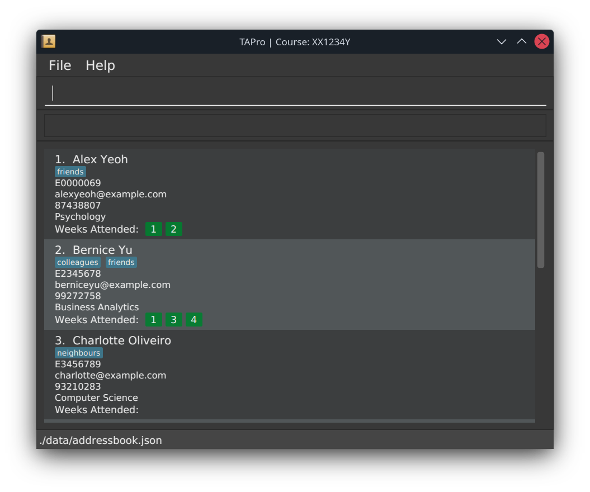
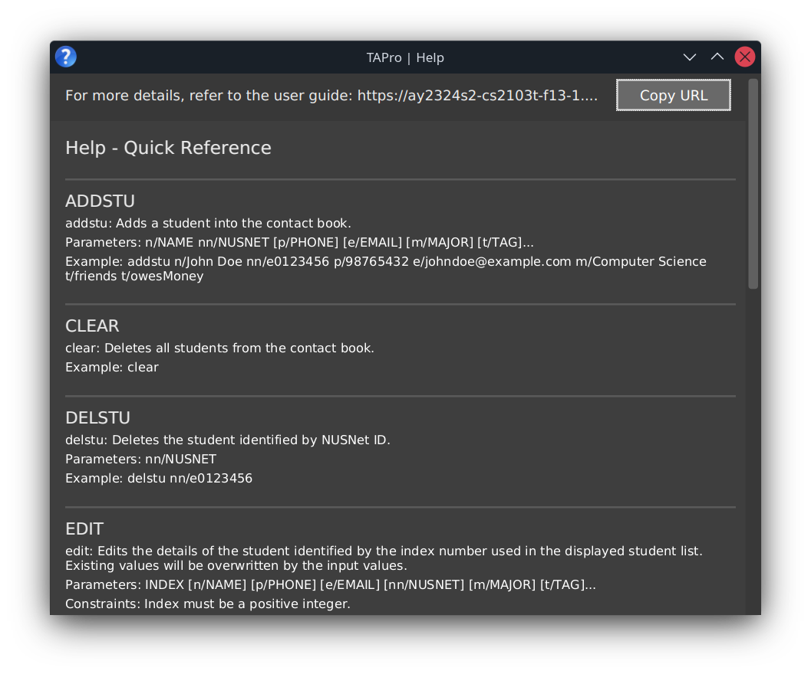
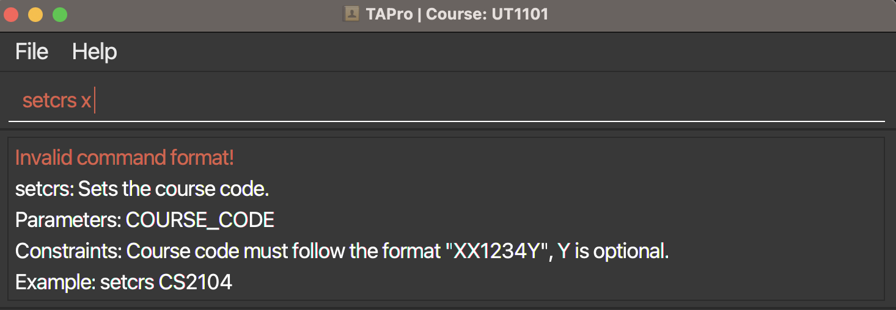
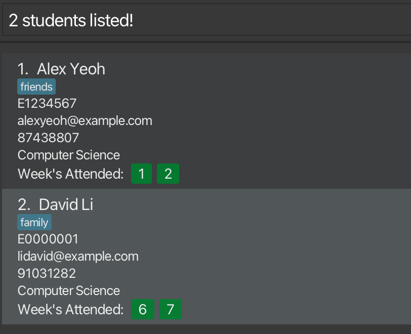



# TAPro User Guide
<p align="center">
    
</p>


TAPro is your go-to **Contact Book application**, created with love for **Computer Science Teaching Assistants (TAs)** like you. _We get it_ — juggling your students and keeping track of attendance can be a handful. That’s why TAPro is 
here to make your life easier. With features designed precisely for you, it's all about simplifying those 
time-consuming tasks, letting you focus on what you do best: teaching and inspiring your students. Welcome to a 
smoother, more personalized way of managing your TA duties!

TAPro is optimized for use via a **Command Line Interface** (CLI) while still having the benefits of a Graphical User Interface (GUI).

If you can type fast, TAPro can get your contact management and attendance taking tasks done **faster** 🚀 than traditional GUI apps.

{{ newPageBetween }}

<!-- * Table of Contents -->
<page-nav-print />

{{ newPage }}

## <i class="fa-solid fa-forward"></i>  Navigating this User Guide

Welcome to the cozy corner of the TAPro User Guide! 🌟 Whether you're embarking on your very first day as a TA or
you're practically a wizard with student info, we've put together this guide to make sure you get the most out of TAPro.

🚀 **Ready to Roll?** Skip over to **[Quick Start](#quick-start)** for the no-fuss, easy-peasy steps to download TAPro and get ready for
action.

**New around here?** No worries, we've got you. Start with these sections to become a TAPro buddy in no time:

- [Navigating the GUI](#navigating-the-gui): Familiarize yourself with the command box and those handy contact cards.
- [Features](#features): Dive into the exciting world of features we've brewed up just for you.

**Already a TAPro champ?** Let's add some spice to your TA skills:

- **[Set Course](#name-rename-cs-course-setcrs)**: Tailor TAPro to your current course with `setcrs`.
- **[Add Student](#adding-a-student-addstu)**: Got a new face in class? Quickly add their details with `addstu`.
- **[Mark](#marking-a-student-s-attendance-for-a-given-week-by-their-nusnet-mark)**: Keep track of weekly attendance with `mark`.
- **[Unmark](#unmarking-a-student-s-attendance-for-a-given-week-by-their-nusnet-unmark)**: Oops, made a mistake? `unmark` reverses that mark.
- **[List](#listing-all-students-list)**: Bring up a complete list of your students with `list`.
- **[Edit](#editing-a-student-edit)**: Update details as they evolve with `edit`.
- **[Find](#locating-students-by-name-find)**: Looking for someone? find helps you search by keyword.
- **[Delete Student](#deleting-a-student-delstu)**: Time to say goodbye? Remove a student from your list with `delstu`.
- **[Clear](#clearing-all-entries-clear)**: Need to wipe the slate clean? `clear` does just that.

**Need a quick TAPro refresher?** Our Command Summary is like the TAPro bible—short, sweet, and to the point.

Stumbled upon a hurdle or just curious? Swing by our **[FAQ](#faq)** where we tackle all your burning questions and offer
nuggets of wisdom for a smooth TAPro journey.
{{ newPage }}

## <i class="fa-solid fa-forward"></i> Useful Notations and Glossary

This segment aims to make your TAPro experience as smooth as silk. With these notions and terms at your fingertips, you're well on your way to becoming a TAPro power user!

Diving into TAPro, you'll encounter some handy notations and terms. We've decoded them here to make your journey smoother and more enjoyable:

### Symbols

Symbols are indicators that give additional information about a target piece of text.

| Symbol                                               | Meaning of target text        |
|------------------------------------------------------|-------------------------------|
| <i class="fa-solid fa-lightbulb text-success"></i>   | Tip                           |
| <i class="fa-solid fa-exclamation text-warning"></i> | Warning                       |
| <i class="fa-solid fa-flag text-danger"></i>         | Important                     |
| <i class="fa-solid fa-info text-info"></i>           | Additional useful information |
| <i class="fa-solid fa-check text-success"></i>       | Valid example                 |
| <i class="fa-solid fa-x text-danger"></i>            | Invalid example               |
| <i class="fa-solid fa-bolt text-danger"></i>         | Danger                        |
| <i class="fa-solid fa-book text-primary"></i>        | Definition                    |
| <i class="fa-solid fa-question text-info"></i>       | Question                      |
| <i class="fa-solid fa-spell-check text-primary"></i> | Command Format                |
| {{ macros.keyFormat('Key') }}                        | Represents a keyboard input.  |

{{ newPageBetween }}

### Keywords

Keywords are word(s) that hold greater significance.

| Keywords                     | Meaning                                                                      |
|------------------------------|------------------------------------------------------------------------------|
| **Attribute**                | A single detail of a student.                                                |
| **Autocomplete**             | A feature that predicts and completes commands as you type.                  |
| **Autocompletion**           | The autocomplete feature's suggested result(s).                              |
| **Command**                  | An executable input text in the command input box.                           |
| **Command History**          | A record of successfully executed commands that can be retrieved for reuse.  |
| **Command Line Interface**   | A text-based interface used for entering commands directly.                  |
| **Command Name**             | The word used to identify that it's associated command is used.              |
| **Graphical User Interface** | The visual interface that enhances user interaction with graphical elements. |
| **Parameter**                | A piece of information can be used in commands to be executed.               |
| **Placeholder Value**        | A parameter value used to indicate that a value is not set for an attribute. |

### Abbreviations

Abbreviations are a shortened form of a word or phrase.

| Abbreviation | Meaning                                            |
|--------------|----------------------------------------------------|
| **ASCII**    | American Standard Code for Information Interchange |
| **CLI**      | Command Line Interface                             |
| **CS**       | Computer Science                                   |
| **GUI**      | Graphical User Interface                           |
| **JSON**     | JavaScript Object Notation                         |
| **NUS**      | National University of Singapore                   |
| **TA**       | Teaching Assistant                                 |
| **UI**       | User Interface                                     |
| **URL**      | Uniform Resource Locator                           |

{{ newPageBetween }}

### Command Format

Commands formats have specific notations to represent how a command can be used.

| Notation                | Meaning                                                         |
|-------------------------|-----------------------------------------------------------------|
| **`prefix/`**           | Represents a prefix.                                            |
| **`UPPER_CASE`**        | Represents parameters that need to be given by you!             |
| **`[ELLIPSIS]...`**     | Indicates that a parameter can be repeated or omitted entirely. |
| **`[SQUARE_BRACKETS]`** | Denotes optional parameters.                                    |

### Parameters and their Recognized Prefixes

{{ macros.definitionBox('Recognized Prefixes', 'Prefixes that have an associated parameter and attribute in TAPro.') }}

| Parameter    | Recognized Prefix | Attribute                            | Constraints                                   |
|:-------------|:------------------|--------------------------------------|-----------------------------------------------|
| **`NAME`**   | `n/`              | Name of the student.                 | Proper-case and alphabetical characters only. |
| **`NUSNET`** | `nn/`             | NUSNet ID of the student.            | Case-insensitive, unique identifier.          |
| **`PHONE`**  | `p/`              | Phone number of the student.         | At least 3 digits, and digits only.           |
| **`EMAIL`**  | `e/`              | Email address of the student.        | Case-insensitive, email address.              |
| **`MAJOR`**  | `m/`              | Major of the student.                | Unconstrained.                                |
| **`TAG`**    | `t/`              | Tag(s) of the student.               | Case-sensitive, alphanumeric without spaces.  |
| **`WEEK`**   | `wk/`             | Week number of student's attendance. | Integer between 1 to 13 (inclusive).          |

<box type="tip" light>

Tags can be associated with a student for categorization.
</box>

### Other Parameters

These parameters are not associated with an attribute and do not have recognized prefixes.

| Parameter           | Meaning                                                                | 
|---------------------|------------------------------------------------------------------------|
| **`COURSE_CODE`**   | Course code which the user is tutoring for.                            |
| **`INDEX`**         | The numbered position of a student in the student contact cards panel. |
| **`KEYWORD`**       | The main search keyword for student names.                             |
| **`MORE_KEYWORDS`** | Additional search keywords for student names.                          |


{{ newPage }}

## <i class="fa-solid fa-forward"></i> Navigating the GUI

Welcome to the TAPro GUI! 🎉 Here's a quick tour to help you get comfortable with the interface:

TODO: Add a screenshot of the GUI with annotations


## <i class="fa-solid fa-forward"></i> Quick start

1. Ensure you have Java 11 or above installed in your computer.

<box type="info" light>

<i class="fa-solid fa-download"></i>
**Installing Java:**


If you do not have Java 11 or above installed, you can download the latest available version of Java from [here](https://www.oracle.com/sg/java/technologies/downloads/). 

For macOS users, you may wish to follow the instructions [here](https://nus-cs2103-ay2324s1.github.io/website/admin/programmingLanguages.html).

Only Java 11 has been tested to work with TAPro, so [check that your Java version](#checking-java-version) is correct if you are facing issues with TAPro.
</box>

2. Download the latest version of `TAPro.jar` from [here](https://github.com/AY2324S2-CS2103T-F13-1/tp/releases).

1. Copy the file to the folder you want to use as the _home folder_ for your TAPro.

1. Open a command terminal, `cd` into the folder you downloaded the JAR file in, and run the `java -jar TAPro.jar` command to launch the application.

<box type="info" light>

A GUI similar to the below image should appear in a few seconds. Note how the app contains some sample data.



</box>
<div style="page-break-after: always;"></div>


5. Type a command in the command input box and press {{ macros.keyFormat('Enter') }} to execute it. 


<box type="success" light>

**#g#Example:##** Typing **`help`** in the command input box and pressing {{ macros.keyFormat('Enter') }} will open the help window.
</box>
<box type="success" light>

**Here are some example commands you can try:**

* `list` : Lists all contacts.

* `addstu nn/E0952224 n/John Doe p/98765432 e/johnd@example.com m/Computer Science` : Adds a student named `John Doe` to the contact book.

* `delstu nn/NUSNET` : Deletes the student with the specified `NUSNET` from the contact book.

* `clear` : Deletes all students, and their contact and attendance information.

* `exit` : Exits the application.

</box>

6. Refer to the sections under [Features](#features) below for details of each command.

{{ newPage }}

## <i class="fa-solid fa-font-awesome"></i> Features

<box type="info" light>

**About the command format:**<br>

<box type="success" light>

<span class="semi-bold">Words in `UPPER_CASE` are the parameters to be supplied by the user.</span>

<span class="semi-bold">#g#Example:##</span> In `addstu n/NAME`, `NAME` is a parameter which can be used as `addstu n/John Doe`.
</box>


<box type="success" light>

<span class="semi-bold">Items in square brackets are optional.</span>

<span class="semi-bold">#g#Example:##</span> `n/NAME [t/TAG]` can be used as `n/John Doe t/friend` or as `n/John Doe`.
</box>

<box type="success" light>

<span class="semi-bold">Items with `…`​ after them can be used multiple times including zero times.</span>

<span class="semi-bold">#g#Example:##</span> `[t/TAG]…​` can be used as ` ` (i.e. 0 times), `t/friend`, `t/friend t/family` etc.
</box>


<box type="success" light>

<span class="semi-bold">Parameters can be in any order.</span>

<span class="semi-bold">#g#Example:##</span> If the command specifies `n/NAME p/PHONE`, `p/PHONE n/NAME` is also acceptable.
</box>

<box type="success" light>

<span class="semi-bold">Extraneous parameters for commands that do not take in parameters (such as `help`, `list`, `exit` and `clear`) will be ignored.</span>

<span class="semi-bold">#g#Example:##</span> If the command specifies `help 123`, it will be interpreted as `help`.
</box>

<box type="success" light>

<span class="semi-bold">Non-recognized prefixes be parsed as part of the previous parameter's value.</span>

<span class="semi-bold">#g#Example:##</span> If the command specifies `addstu n/John Doe a/Non-recognized-prefix`, it would be parsed as `NAME` parameter being `John Doe a/Non-recognized-prefix`, instead of just `John Doe`, as `a/` is not a [recognized prefix](#parameters-and-their-recognized-prefixes).
</box>

</box>

<box type="warning" light>

<i class="fa-solid fa-file-lines"></i>
**When using a PDF version of this document:**

Be careful when copying and pasting commands that span multiple lines as space characters surrounding line-breaks may be omitted when copied over to the application.
</box>

{{ newPage }}

### <i class="fa-solid fa-circle-question"></i> Viewing help : `help`

Entering the `help` command opens a help window that shows a message explaining how to access the help page,
as well as quick reference of each command with simple examples on how to use them.

<box type="definition" icon=":fa-solid-spell-check:" light>

**Format: `help`**
</box>
<box type="info" light>

<i class="fa-regular fa-window-restore"></i>
**A new window is opened:**

A new window is opened, so that it does not clutter up your main window. A GUI similar to the below image should appear.



</box>

<box type="info" light>

**More about help's quick reference:**

The quick reference is meant for {{ macros.semiBold('fast and reliable') }} lookup of commands and their usages, without needing an internet connection and opening a browser to get an overview of the commands.

* It is not meant to contain detailed information about each command. To access detailed information about each command, you can refer to our user guide.
  </box>

<box type="tip" light>

<i class="fa-solid fa-maximize"></i>
**Resizing the help window:**

The help window is resizable, so you can {{ macros.semiBold('easily reposition and resize') }} it to fit anywhere on your screen, exactly where you want it to be.
</box>

<box type="tip" light>

<i class="fa-solid fa-window-restore"></i>
**Switching quickly between the help and main window:**

* On Windows and most Linux distributions, you can use the keyboard shortcut: {{ macros.keyFormat('Alt') }} + {{ macros.keyFormat('Tab') }}, to switch between windows quickly.

* On macOS, you can use the keyboard shortcut: {{ macros.keyFormat('⌘Cmd') }} + {{ macros.keyFormat('`') }}, to switch between windows quickly.
  </box>

{{ newPage }}

### <i class="fa-solid fa-chalkboard"></i> Name/Rename CS course : `setcrs`

Sets the course code in question.

Course is shown at the top of the window.

<box type="definition" icon=":fa-solid-spell-check:" light>

**Format: `setcrs COURSE_CODE`**
</box>

<box type="info" light>

Course codes are case-insensitive.

</box>

Here is the output in the command results when the `setcrs` command is successful:


<box type="warning" light>

Course code should follow the format "XX1234Y", Y is optional.


When an invalid course code is entered, the following error message appears:


</box>

{{ newPage }}


### <i class="fa-solid fa-user-plus"></i> Adding a student: `addstu`
Adds a student to the contact book.

<box type="definition" icon=":fa-solid-spell-check:" light>

**Format: `addstu n/NAME nn/NUSNET [p/PHONE] [e/EMAIL] [m/MAJOR] [t/TAG]…​`**
</box>

* Adds a student with the given details.

* The name and NUSNet ID must be provided, as they are not optional parameters.

* And NUSNet ID must be unique.

<box type="info" light>

**Case-insensitivity of NUSNet ID:**

NUSNet ID is case-insensitive, and it will be converted to uppercase automatically upon running the command.

For example, `e0123456` will be converted to `E0123456`, as `E0123456` and `e0123456` refer to the same NUSNet ID.
</box>

* Name must not be empty (or spaces only), and must have single spaces between words. It must be in proper-case and contain only alphabets.

<box type="warning" light>

**Adding un-permitted names:**

In the current version of TAPro, certain names are not permitted due to the strictness of name validation. 

The current workaround is to follow the proper-case format and make slight changes to the name, so that the validation works.

<box type="success" light>

{{ macros.semiBold('#g#Example:##') }} For names like `Zubir bin Said` and `Balaji s/o Sadasivan`, we can make slight changes to the name to fit current permitted formats. 
They become `Zubir Bin Said` and `Balaji So Sadasivan` after the change, which are still similar enough to the original to not cause confusion.
</box>
</box>

* All the remaining fields are optional. If values are not provided to optional fields, they will be set to a placeholder value under the hood (e.g., `Major not provided` for `MAJOR` field).

<box type="info" light>

**Any number of tags:**

A student can have any number of tags, including 0.
</box>
<box type="success" light>

**Alphanumeric tags**

{{ macros.semiBold('#g#Example:##') }} `bestFriend4Ever`, `colleague`, `Club` are valid tags, but `best friend`, `best-friend` are not valid tags.
</box>
<box type="tip" light>

**Adding multiple majors:**

If a student is undertaking a double degree programme, you can use a comma to separate the disciplines in the `MAJOR` field.

<box type="success" light>

<span class="semi-bold">#g#Example:##</span> We can use `m/Computer Science, Mathematics` to indicate that a student has these two majors, Computer Science and Mathematics.
</box>
</box>

<box type="success" light>

**#g#Examples:##**

* `addstu n/John Doe nn/E1234567 p/98765432 e/johnd@example.com m/Computer Science`

* `addstu n/Betsy Crowe nn/E0123456 t/friend e/betsycrowe@example.com m/Mathematics, Physics p/1234567 t/club`

* `addstu n/Betsy Crowe nn/E0123456`
  </box>

{{ newPage }}

### <i class="fa-solid fa-list-ul"></i> Listing all students : `list`

Shows a list of all persons in the contact book.

<box type="definition" icon=":fa-solid-spell-check:" light>

**Format: `list`**
</box>

If there are additional arguments behind `list` we will simply ignore them.

{{ newPage }}

### <i class="fa-solid fa-user-pen"></i> Editing a student : `edit`

Edits an existing student in the contact book.

<box type="definition" icon=":fa-solid-spell-check:" light>

**Format: `edit INDEX [n/NAME] [p/PHONE] [e/EMAIL] [m/MAJOR] [nn/NUSNET] [t/TAG]…​`**
</box>

* Edits the student at the specified `INDEX`. The index refers to the index number shown in the displayed student list. The index **must be a positive integer**, such as 1, 2, 3, …​

* At least one of the optional fields must be provided.

* Existing values will be updated to the input values.

* When editing tags, the existing tags of the student will be removed, i.e adding of tags is not cumulative.

* You can remove all the student’s tags by typing `t/` without
  specifying any tags after it.

<box type="warning" light>

When `t/` is specified in the command, no other tags can be present, in order to remove all of a student's tag. 

Otherwise, TAPro will parse the input as adding multiple tags, which may lead to an unsuccessful execution of the command.

<box type="success" light>

**#g#Example:##** Entering `edit 1 t/abc t/` will cause the error message `Tags names should be alphanumeric` to be shown. This error message is shown because TAPro expects the second `t/` to contain an alphanumeric value, which an empty value is not.
</box>
</box>

<box type="success" light>

**#g#Examples:##**

*  `edit 1 p/91234567 e/johndoe@example.com` Edits the phone number and email contact of the first student to be `91234567` and `johndoe@example.com` respectively.

*  `edit 2 n/Betsy Crower t/` Edits the name of the second student to be `Betsy Crower` and clears all existing tags.
   </box>
   <box type="info" light>

This command differs from most other commands that uses `NUSNET` to identify a student. This command uses the index number shown in the displayed person list to identify the student to be edited.
</box>

{{ newPage }}

### <i class="fa-solid fa-magnifying-glass"></i> Locating students by name: `find`

Finds students whose names contain any of the given keywords.

<box type="definition" icon=":fa-solid-spell-check:" light>

**Format: `find KEYWORD [MORE_KEYWORDS]…​`**
</box>
<box type="info" light>

**Parameters of `find` command:**

Both `KEYWORD` and `[MORE_KEYWORDS]…​` accept alphanumeric and special symbols as their supplied value, and are separated by spaces when supplied.

* `KEYWORD` is the first keyword to search for. This is a compulsory parameter.

* `[MORE_KEYWORDS]…​` are additional, optional keywords to search for. You can have any number of additional keywords.

</box>

<box type="info" light>

**About the `find` command:**

<box type="success" light>

<span class="semi-bold">Only the name is searched.</span>

<span class="semi-bold">#g#Example:##</span> `E01234567` will not match a student with NUSNet ID `E01234567`.
</box>

<box type="success" light>

<span class="semi-bold">The name search is case-insensitive.</span>

<span class="semi-bold">#g#Example:##</span> `hans` will match `Hans`
</box>


<box type="success" light>

<span class="semi-bold">The order of the keywords does not matter.</span>

<span class="semi-bold">#g#Example:##</span> `Hans Bo` will match `Bo Hans`
</box>

<box type="success" light>

<span class="semi-bold">Only full words will be matched.</span>

<span class="semi-bold">#g#Example:##</span> `Han` will not match `Hans`
</box>

<box type="success" light>

<span class="semi-bold">Students' name matching at least one keyword will be returned (i.e. `OR` search).</span>

<span class="semi-bold">#g#Example:##</span> `Hans Bo` will return `Hans Gruber`, `Bo Yang`
</box>
</box>

<box type="warning" light>

**Find does not give any error message when invalid parameters are supplied.**
</box>

<div style="page-break-after: always;"></div>

<box type="success" light>

**Examples of using the `find` command:**

<box type="success" light>

<span class="semi-bold">#g#Example:##</span> `find John` returns `john` and `John Doe`
</box>


<box type="success" light>

<span class="semi-bold">#g#Example:##</span> `find alex david` returns `Alex Yeoh`, `David Li`, as seen in the image below.


</box>
</box>

{{ newPage }}

### <i class="fa-solid fa-square-check"></i> Marking a student's attendance for a given week by their NUSNet: `mark`

Marks a student's attendance for a particular week.

<box type="definition" icon=":fa-solid-spell-check:" light>

**Format: `mark nn/NUSNET wk/WEEK`**
</box>
<box type="success" light>

**#g#Example:##** `mark nn/E1234567 wk/3`
</box>

{{ newPage }}

### <i class="fa-solid fa-square-xmark"></i> Unmarking a student's attendance for a given week by their NUSNet: `unmark`

Unmarks a student's attendance for a particular week.

<box type="definition" icon=":fa-solid-spell-check:" light>

**Format: `unmark nn/NUSNET wk/WEEK`**
</box>
</box>
<box type="success" light>

**#g#Example:##** `unmark nn/E1234567 wk/3`
</box>

{{ newPage }}

### <i class="fa-solid fa-trash"></i> Deleting a student: `delstu`

Deletes the specified student from the contact book.

<box type="definition" icon=":fa-solid-spell-check:" light>

**Format: `delstu nn/NUSNET`**
</box>

* Deletes the student with the specified NUSNet ID from the contact book.

<box type="success" light>

**#g#Example:##** `delstu nn/E0957499` deletes the student with the NUSNet ID of `E0957499` from the contact book.

</box>
<box type="tip" light>

**Easily find and delete students:**

If you cannot remember your student's NUSNet ID, you could use `find Betsy` or `list` followed by `delstu nn/<Betsy's NUSNET>` to find and delete the student.
</box>

{{ newPage }}

### <i class="fa-solid fa-broom"></i> Clearing all entries : `clear`

Clears all entries from the contact book.

<box type="definition" icon=":fa-solid-spell-check:" light>

**Format: `clear`**
</box>

{{ newPage }}

### <i class="fa-solid fa-right-from-bracket"></i> Exiting the program : `exit`

Exits the program.

<box type="definition" icon=":fa-solid-spell-check:" light>

**Format: `exit`**
</box>

{{ newPage }}

### <i class="fa-solid fa-wand-magic-sparkles"></i> Autocomplete

The autocomplete feature autocompletes a parameter or command, based on the current command box input and the current data in TAPro. This means that if an attribute value is not present, it will not be present in the autocompletion of that corresponding parameter.

{{ macros.definitionBox('Autocompletion', 'The autocomplete feature\'s suggested result(s).') }}

We can autocomplete both command names and parameters after their prefixes by pressing {{ macros.keyFormat('Tab') }}, when an autocompletion is available.

<box type="important" light>

**Autocompletes the first word as a command name:**

The first word, will be autocompleted as a command name, instead of a parameter, if an autocompletion can be found for the current word that is in the command box input.

<box type="warning" light>
<span class="semi-bold">The command input box must not be empty</span> for autocomplete to work.
</box>

<box type="success" light>

<span class="semi-bold">#g#Example:##</span>

We have three students with NUSNet IDs `E0123456`, `E1234567` and `E2345678`.
If we type `mark nn/` into the command input box and press {{ macros.keyFormat('Tab') }} ,
we can see that the text in the command input box autocompletes to become `mark nn/E01234567`.

Pressing {{ macros.keyFormat('Tab') }}  again, causes the text to update to `mark nn/E1234567`,
followed by `mark nn/E2345678`.
</box>

<box type="info" light>

If we type `a` into the command input box and press {{ macros.keyFormat('Tab') }}, we see that the text in the command input box autocompletes to become `addstu`.

The last parameter `TAG` is autocompleted.
</box>
</box>

<box type="important" light>

**Autocompletes the last parameter in the input:**


Autocomplete works on the last parameter (if any) in the command box, which is the text directly after a [recognized prefix](#parameters-and-their-recognized-prefixes).


<box type="warning" light>

A parameter can only be autocompleted if it is not the first word, and has a [recognized prefix](#parameters-and-their-recognized-prefixes).
</box>

<box type="success" light>

<span class="semi-bold">#g#Example:##</span>

We have some students in TAPro, such that the first tag alphabetically is `friends`.
If we type `edit 1 n/John Doe t/` into the command input box and press {{ macros.keyFormat('Tab') }},
we see that the text in the command input box autocompletes to become `edit 1 n/John Doe t/friends`.

The last parameter `TAG` is autocompleted.
</box>
</box>
{{ newPageBetween }}

<box type="info" light>

**Autocomplete scrolls through all autocompletions:**

Autocomplete will scroll through all possible suggestions, based on the existing data in your contact list.

When reaching the end of the all possible suggestions, pressing {{ macros.keyFormat('Tab') }} will wrap
the possible options back to the start of that list again.

<box type="success" light>

<span class="semi-bold">#g#Example:##</span>

We have three students with NUSNet IDs `E0123456`, `E1234567` and `E2345678`.
If we type `mark nn/` into the command input box and press {{ macros.keyFormat('Tab') }},
we can see that the text in the command input box autocompletes to become `mark nn/E0123456`.

Every press of {{ macros.keyFormat('Tab') }}, causes the command input box text to update to the next autocompletion:
* from `mark nn/E0123456` to `mark nn/E1234567`,
* then to `mark nn/E2345678`,
* and then back to `mark nn/E0123456`.
  </box>
  </box>

<box type="warning" light>

**Autocomplete is omitted on week number.**

Autocomplete does not work for week number, because `WEEK` is at most two digits, so it is much faster just typing out the number.
</box>

<box type="tip" light>

**Sorted autocompletions:**

The autocompletions will be listed in [ASCIIbetical order](https://en.wikipedia.org/wiki/ASCII#Character_order), which is when all uppercase letters come before lowercase letter, and digits and most punctuations come before letters.

<box type="success" light>

<span class="semi-bold">#g#Example:##</span>
If we have only the following tags in our contact list: `abc`, `123` `BCD`, `234`, `bcd`, autocompleting a `TAG` will give autocompletions in this order: `123`, `234` `BCD`, `abc`, `bcd`.

</box>
</box>

<box type="tip" light>

**Quickly clear an attribute with autocomplete:**

We can autocomplete the placeholder value, if it is present for that parameter in our contact list. When a placeholder value is inputted as the parameter, it means that attribute for that student will be reset, after entering the command.

<box type="success" light>

<span class="semi-bold">#g#Example:##</span>

If the placeholder for the `MAJOR` parameter, `Major not provided`, is present in the contact list, then in the autocompletion for the `MAJOR` parameter, the value `Major not provided` is available.
</box>
</box>

{{ newPage }}

### <i class="fa-regular fa-circle-up"></i> Retrieving command history

TAPro saves successful commands input, so you can retrieve them later, using the
{{ macros.keyFormat('Up', '<i class="fa-regular fa-square-caret-up"></i>') }} and
{{ macros.keyFormat('Down', '<i class="fa-regular fa-square-caret-down"></i>') }} arrow keys.

<box type="success" light>

<span class="semi-bold">#g#Example:##</span>

1. `mark nn/E0123456` was the previous successful command.
1. Now the command input box is empty.
1. Pressing {{ macros.keyFormat('Up', '<i class="fa-regular fa-square-caret-up"></i>') }} will
   fill the text in the command input box to
   the previous command `mark nn/E0123456`!
1. You can press {{ macros.keyFormat('Up', '<i class="fa-regular fa-square-caret-up"></i>') }} continuously to scroll through all the previous commands you have entered.
1. Pressing {{ macros.keyFormat('Down', '<i class="fa-regular fa-square-caret-down"></i>') }} will
   scroll back to the more recent commands you have entered.
   </box>


<box icon=":fa-solid-bolt:" theme="danger" light>

**Current input is erased:**

When retrieving commands, be aware that it will erase the current text in the command input box.
</box>

<box type="warning" light>

**Your current input is the latest:**

Pressing {{ macros.keyFormat('Down', '<i class="fa-regular fa-square-caret-down"></i>') }} without
having ever pressed {{ macros.keyFormat('Up', '<i class="fa-regular fa-square-caret-up"></i>') }}
will attempt to retrieve a later command, which is empty text, because you are at your most recent command.
</box>

<box type="warning" light>

**Retrieves only successful input:**

Only commands that has succeeded previously will be retrieved. If you enter an invalid command, it will not appear
when attempting to retrieve it.
</box>

{{ newPage }}

### <i class="fa-solid fa-floppy-disk"></i> Saving the data

TAPro's data are saved in the hard disk automatically after any command that changes the data. There is no need to save manually.

{{ newPage }}

### <i class="fa-solid fa-pen-to-square"></i> Editing the data file

TAPro's data are saved automatically as a JSON file `[JAR file location]/data/addressbook.json`. Advanced users are welcome to update data directly by editing that data file.

<box type="warning" light>

**Invalid data file format:**

If your changes to the data file makes its format invalid, TAPro will discard all data and start with an empty data file at the next run.  Hence, it is recommended to take a backup of the file before editing it.<br>

Furthermore, certain edits can cause the TAPro to behave in unexpected ways (e.g., if a value entered is outside the acceptable range). Therefore, edit the data file only if you are confident that you can update it correctly.
</box>

{{ newPage }}

## <i class="fa-solid fa-comments"></i> FAQ

### Transfering Data to Another Computer
<box type="info" icon=":fa-solid-question:" light>

**Q**: <span class="semi-bold">How do I transfer my data to another computer?</span>

**A**: Install the application in the target computer and replace the `data` folder with the `data` folder in
your current computer! Click `Yes` if are prompted to replace the existing `data` folder in your target computer.
</box>

### Loading Data from Another Computer
<box type="info" icon=":fa-solid-question:" light>

**Q**: <span class="semi-bold">How can I transfer my TAPro contacts to another computer?</span>

**A**: Install TAPro in your target computer and paste the empty `data` folder it creates
with the `data` folder from your otehr computer. Paste it in the same directory as your TAPro JAR file in your
target computer.
</box>

### Launching TAPro
<box type="info" icon=":fa-solid-question:" light>

**Q**: <span class="semi-bold">How can I launch TAPro if clicking on the JAR file does not work?</span>

**A**: There are two possible methods to launch TAPro.

**Method 1**: <span class="semi-bold">Using the Command Terminal</span>
1. Open the command line in your operating system's terminal software.
2. Navigate to the directory where the JAR file is located.
3. Enter `java -jar TAPro.jar` and the TAPro Application should launch.

**Method 2**: <span class="semi-bold">Using `.bat/.sh` Scripts</span>
1. Create a new text file and paste the following code into the file and edit it according to the comments:
   ```sh
      java -jar <abosute_path_to_TAPro.jar> 
   ```
   Replace `<absolute_path_to_TAPro.jar>` with the path to TAPro on your system, in quotes.<br>

   <box type="success" light>

    <span class="semi-bold">#g#Examples:##</span>

    * On Windows: `java -jar "C:\Users\YOUR_USERNAME\Downloads\TAPro.jar"`<br>
    
    * On Linux: `java -jar /home/YOUR_USERNAME/Downloads/TAPro.jar`<br>
    
    * On macOS: `java -jar "/Users/YOUR_USERNAME/Downloads/TAPro.jar"`<br>
    </box>

2. Save the file as `TAPro.bat` (Windows) or `TAPro.sh` (macOS/Linux).
3. Change the admin settings of the script to allow it to run as a program:
    - Windows: Right-click on the script and select Properties. Under General, check the box that says `Allow this file to run as a program`.
    - macOS/Linux: Open the Terminal and navigate to the directory where the script is located. Type `chmod +x <script_file_name>` and press `Enter`.<br>

   <box type="info" light>

   `chmod +x` changes the permissions of the script to allow it to be executed.
   </box>

4. Double-click on the script to launch TAPro.
   </box>

### Checking Java Version
<box type="info" icon=":fa-solid-question:" light>

**Q**: <span class="semi-bold">How can I check my Java version?</span>

**A**: Open a command line and type `java -version`. If the command is not recognized, it means you do not have Java installed. You can install Java 11 using the Oracle guide [here](https://www.oracle.com/java/technologies/downloads/#java11). Alternatively, you can install the OpenJDK version. For macOS users, you may wish to follow the instructions [here](https://nus-cs2103-ay2324s1.github.io/website/admin/programmingLanguages.html).
</box>

### Using TAPro

<box type="info" icon=":fa-solid-question:" light>

**Q**: <span class="semi-bold">What are the available commands in TAPro?<span>

**A**: Please refer to the [Command Summary](#command-summary) for the list of available commands.
</box>
<box type="info" icon=":fa-solid-question:" light>

**Q**: <span class="semi-bold">Do I need an internet connection to use TAPro?<span>

**A**: All of TAPro's functionality can be used offline! No internet connection is required.
</box>
<box type="info" icon=":fa-solid-question:" light>

**Q**: <span class="semi-bold">How do I save my data?</span>

**A**: Data is saved in the hard disk automatically after any command that changes the data. There is no need to save manually.
</box>
<box type="info" icon=":fa-solid-question:" light>

**Q**: <span class="semi-bold">How can I remove a student's attendance for a particular week?</span>

**A**: In TAPro, you can remove a student's attendance for a particular week using the `unmark` command! The syntax
for the `unmark` command is as follows:
<br><br>The syntax for the `unmark` command is as follows:
```
unmark nn/NUSNET wk/WEEK
```
</box>
<box type="info" icon=":fa-solid-question:" light>

**Q:** <span class="semi-bold">Long names, phone numbers, emails and majors are truncated in the UI. Why does TAPro not make these text wrap around?</span>

**A:**  By [international standards](https://en.wikipedia.org/wiki/E.164), telephone numbers should not exceed 15 digits. And typical names and email addresses are rarely too long, which falls outside of normal use cases. Lastly, most students will have no more than 2 majors. So under any normal use case, the fields will not contain texts long enough to be truncated. Having a single line of text for each field also ensures the UI remains clean and uncluttered.
</box>
{{ newPageBetween }}
<box type="info" icon=":fa-solid-question:" light>

**Q**: <span class="semi-bold">Can I add tags to a TAPro contact if I want to remember something additional, like a birthday?</span>

**A**: Yes you can! In fact, you may use the `TAG` parameter of a contact to store any information you want. Simply
use `edit` with the `INDEX` of the student and the information you wish to add to the contact, and you should be on your way!

<box type="info" light>

Tags are alphanumeric and cannot contain spaces or special characters.
</box>
<box type="success" light>

<span class="semi-bold">#g#Example:##</span> Using tag as a birthday for contacts
```
edit 1 t/12Dec
edit 2 t/25Jan
edit 3 t/1Mar
```
</box>
<box type="success" light>

<span class="semi-bold">#g#Example:##</span> Using tag as a industry interest
```
edit 1 t/EduTech
edit 2 t/Finance
edit 3 t/HealthTech
```
</box>
<box type="warning" light>

Adding new tag(s) will replace the existing tag(s).
</box>
</box>


### Saving More Time
<box type="info" icon=":fa-solid-question:" light>

**Q**: <span class="semi-bold">How can I save more time when using TAPro?</span>

**A**: You can use the advanced features like **[autocomplete](#autocomplete)** and **[command history toggle](#retrieving-command-history)** in TAPro!
These
features are
designed to help you input commands faster and more efficiently.

<box type="success" light>

<span class="semi-bold">#g#Example:##</span> Unmarking a wrongly marked  student's attendance

1. `mark nn/E0123456 wk/6`
1. Press the {{ macros.keyFormat('Up', '<i class="fa-regular fa-square-caret-up"></i>') }} key to
   retrieve the previous command.
1. Hold the {{ macros.keyFormat('Left', '<i class="fa-regular fa-square-caret-left"></i>') }} key to
   move the cursor to the beginning of the command.
1. Add a `un` in front of `mark` to change the command to `unmark nn/E0123456 wk/6`.
1. Press `Enter`!

</box>
<box type="info" light>

Future enhancements include pressing the {{ macros.keyFormat('Right', '<i class="fa-regular fa-square-caret-right"></i>') }} key to move the cursor to
the front of your input.
</box>
</box>

{{ newPage }}

## <i class="fa-solid fa-triangle-exclamation"></i> Known issues

<box icon=":fa-solid-bolt:" theme="danger" light>

**1. Using multiple screens**

If you move the application to a secondary screen, and later switch to using only the primary screen, the GUI will open off-screen. The remedy is to delete the `preferences.json` file created by the application before running the application again.
</box>

<box icon=":fa-solid-bolt:" theme="danger" light>

**2. Having more than one instance of TAPro running**

If you have more than one instance of TAPro running, the application may not function as expected. TAPro's data will desynchronise. The remedy is to close all instances of TAPro and run only one instance of TAPro.
</box>

<box icon=":fa-solid-bolt:" theme="danger" light>

**3. When the data file is in an invalid format**

If you [edit the data file](#editing-the-data-file) into an invalid format, upon the next launch of TAPro, no error message would be shown, and all data will be discarded. The remedy is to store a backup of your data file before modifying it, to prevent the loss of data.
</box>

{{ newPage }}

## <i class="fa-solid fa-table-list"></i> Command summary

| Action             | Format                                                           | Examples                                                                                                 |
|--------------------|------------------------------------------------------------------|----------------------------------------------------------------------------------------------------------|
| **Add Student**    | `addstu n/NAME nn/NUSNET [p/PHONE] [e/EMAIL] [m/MAJOR] [t/TAG]…` | `addstu n/James Ho p/22224444 e/jamesho@example.com nn/E1234567 m/Computer Science t/friend t/colleague` |
| **Clear**          | `clear`                                                          | `clear`                                                                                                  |
| **Delete Student** | `delstu nn/NUSNET`                                               | `delstu nn/E0957499`                                                                                     |             
| **Edit**           | `edit INDEX [n/NAME] [p/PHONE] [e/EMAIL] [m/MAJOR] [t/TAG]…​`    | `edit 2 n/James Lee e/jameslee@example.com`                                                              |
| **Find**           | `find KEYWORD [MORE_KEYWORDS]…​`                                 | `find James Jake`                                                                                        |
| **List**           | `list`                                                           | `list`                                                                                                   |
| **Mark**           | `mark nn/NUSNET wk/WEEK`                                         | `mark nn/E1234567 wk/3`                                                                                  |
| **Unmark**         | `unmark nn/NUSNET wk/WEEK`                                       | `unmark nn/E1234567 wk/3`                                                                                |
| **Set Course**     | `setcrs COURSE_CODE`                                             | `setcrs CS2103`                                                                                          |
| **Exit**           | `exit`                                                           | `exit`                                                                                                   |
| **Help**           | `help`                                                           | `help`                                                                                                   |
